# Engram-Based Memory Architecture
## A neuroscience-inspired memory architecture for AI agents

**Guiding Principle:** What would the brain do?

---

## The Starting Question

An AI agent executes thousands of interactions. It observes, decides, makes mistakes, learns — or doesn't learn. It repeats errors it has already made. It forgets context that would be relevant. It treats each situation as new, even though it has experienced similar situations hundreds of times.

The problem is not a lack of computing power. It is a lack of memory architecture.

The human brain has developed a solution over millions of years that addresses this exact problem: selectively store, gradually learn, actively forget, abstract. The Engram-Based Memory Architecture transfers these biological principles to an AI system — not as a metaphor, but as functional design.

---

## The Guiding Principle

Every decision in this architecture begins with the same question:

**What would the brain do?**

This is not a dogma — it is a compass. Where the biological system has a clear mechanism, it is adopted or adapted. Where there is no direct mechanism, neuroscience at least provides the right questions.

---

## The Four Core Ideas

### 1. Engrams — Memory has a physical form

An Engram is not simply "stored information". It is a specific pattern of connections that is actively maintained, strengthened, or weakened. Engrams do not arise automatically from every experience — they must be earned. Through relevance, surprise, repetition, or emotional significance.

The system does not store facts. It stores **meaningful patterns** — with strength, context, and a history of activation.

### 2. Complementary Learning Systems — Two systems instead of one

The brain solves a problem that has blocked AI research for decades: How can a system learn new things quickly without destroying what it already knows?

The answer is architectural: two separate systems with different time scales. A fast, specific system that captures new episodes immediately — and a slow, generalizing system that abstracts over time. Both work together and complement each other.

In this architecture: **Pre-Engram Buffer + Engram Dictionary** as a hippocampal system, **Schema Storage (Meta-Engrams)** as a neocortical system.

### 3. Consolidation — Memory is not an archive, but a process

Memories do not come into being once and then remain unchanged. They are continuously evaluated, rebuilt, compressed, and forgotten. This process happens in sleep — and in the system as a Nightly Consolidation Run.

Important information is strengthened. Unimportant information decays. Individual episodes are compressed into abstract schema knowledge. Forgetting is not a failure — it is a quality mechanism.

### 4. Meta-Engrams and Schemas — From individual cases to understanding

When the same pattern has been consolidated often enough, something new arises: not an Engram that encodes a specific experience, but an expectation structure. A Schema. It says: if X, then probably Y — not because it happened once, but because it always happens that way.

Meta-Engrams are Engrams about Engrams. They encode not experiences, but rules. Over time they become hippocampus-independent — the system "understands" them without having to re-derive them from individual Episodes each time.

---

## The Overall System at a Glance

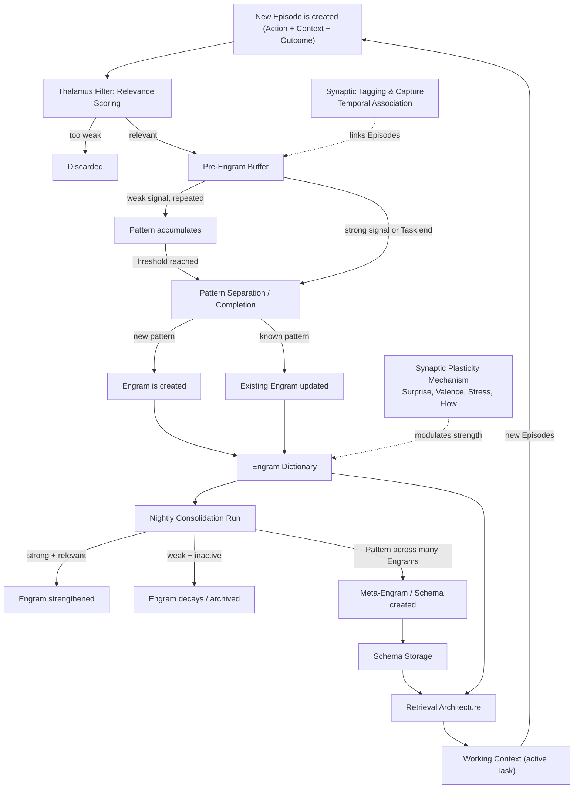

---

## Table of Contents

| Chapter | Title | Core Question |
|---|---|---|
| 1 | Complementary Learning Systems | Why two separate systems — and why is that the only robust solution? |
| 2 | Thalamus Filter | What is worth remembering? |
| 3 | Memory Engrams | What is a memory physically? |
| 4 | Pre-Engram Buffer | What happens to weak signals? |
| 5 | Pattern Separation / Completion | How does the system recognize new vs. known? |
| 6 | Nightly Consolidation Run | How is knowledge sorted and compressed? |
| 7 | Schema Theory | How does real understanding arise from facts? |
| 8 | Synaptic Plasticity | Why do we learn more from some things? |
| 9 | Replay & Prediction Error | How does the system learn from mistakes? |
| 10 | Constructive Memory | Is memory recording or reconstruction? |
| 11 | Retrieval Architecture | How does the system find the right thing at the right time? |
| 12 | Synaptic Tagging & Capture | Why does incidental information become embedded through context? |
| 13 | Working Context | How does the agent coordinate everything in the running moment? |

---

## How the Chapters Connect

The 13 chapters describe parts of a single, interconnected system. Each builds on the previous and sets up the next. At the start of each chapter, an **Introduction** section frames the context. At the end, a **Continuing in the System** section leads to the next question.

The final chapter closes the circle back to the first: the Working Context opens, a new Episode is created, the Thalamus Filter evaluates — and the architecture begins again.

---

## What This Architecture Is

This is a conceptual blueprint — a precise description of the mechanisms from which a living memory architecture is built, and how these mechanisms interlock.

The goal is not a passive storage system that stores information and returns it on request. The goal is an active memory agent: a system that evaluates experiences, abstracts knowledge, recognizes patterns before they become explicit, learns from mistakes, and continuously reorganizes its own knowledge state. A system that does not wait to be asked — but works in the background and foreground simultaneously.

Every mechanism is biologically grounded. Every design decision follows the guiding principle: What would the brain do?

---

## Where to Begin

Before any mechanism can be understood, one question must be answered: *why is the system built this way at all?* The answer lies in the most fundamental constraint in AI memory research — Chapter 1: Complementary Learning Systems.


---

# Complementary Learning Systems (CLS)
## Why Two Separate Systems Are the Fundamental Requirement for Persistent Learning


## Introduction

Before any component of this architecture can be understood, one question must be answered: Why is the system built the way it is? Why two separate stores instead of one? Why a slow consolidation process instead of direct writing? Why a buffer that expires instead of a permanent record?

The answer is not a design preference. It is a hard constraint that emerges from one of the oldest unsolved problems in AI research — Catastrophic Interference. And the brain solved it millions of years ago with a surprisingly simple idea: two systems instead of one.

Everything that follows in this architecture is a direct consequence of it.

---

## 1. The Core Problem — Catastrophic Interference

Before the architecture can be explained, the problem it solves must be understood.

Imagine a system that has only a single memory store. It learns Task A and encodes the knowledge in its connection weights. Then it learns Task B. To learn Task B, the same weights must be adjusted—and in doing so, the new knowledge overwrites the old. Task A is forgotten. Completely.

This is called **Catastrophic Interference**—and it is the fundamental learning problem of any system that stores knowledge in distributed representations. Neural networks suffer greatly from it. And classical AI Memory systems with a single vector store have the same problem in a different form.

The brain solved this problem millions of years ago—through architectural separation.

---

## 2. Biological Foundation — The Two Systems

The **Complementary Learning Systems Theory** (McClelland, McNaughton & O'Reilly, 1995) describes how the brain prevents Catastrophic Interference: through two fundamentally different learning systems that work in parallel and complementary fashion.

### System 1 — Hippocampus: Fast, Specific, Episodic

The hippocampus learns extremely quickly—a single experience is sufficient for a stable representation. It uses **sparse, pattern-separated** representations: similar experiences are deliberately stored as distinct patterns to minimize overlap and interference.

This has a price: the hippocampus cannot generalize well. It remembers the concrete individual case—not the abstract principle behind it. And its memory is limited—it is designed as a buffer, not as a permanent archive.

### System 2 — Neocortex: Slow, Generalizing, Structural

The neocortex learns extremely slowly—knowledge must repeat hundreds of times before it is permanently integrated. It uses **overlapping, distributed** representations: similar concepts share neural resources and thus form abstract structures.

This allows generalization—the neocortex extracts the principle behind many individual cases. But this very overlap makes it susceptible to interference when new information is written too quickly.

### The Complementary Solution

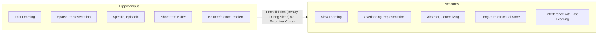

The two systems solve complementary sub-problems—and their interaction through consolidation transforms specific episodic knowledge into generalized structural Schemas without Catastrophic Interference. The **Entorhinal Cortex** acts as a gateway: it coordinates the bidirectional flow of information between the hippocampus and neocortex (cf. Chapter 5).

---

## 3. Why a Single System Always Fails

This is the central theoretical statement of CLS theory—and it has direct implications for AI Memory design:

**A fast-learning system with overlapping representations** suffers Catastrophic Interference. Every new learning destroys old knowledge.

**A slow-learning system with sparse representations** cannot learn from single experiences. It needs hundreds of repetitions before new information is integrated.

**A single system that attempts both**—fast and generalizing—becomes either unstable or learns too slowly for practical use.

The only robust solution is architectural separation with a consolidation bridge between them.

---

## 4. How the Architecture Will Be Built From This Principle

Every component in the Engram architecture is a direct answer to a CLS requirement. This section is a preview — a map of what the following documents will describe, and *why* each piece is designed the way it is.

### 4.1 The Thalamus Filter — Hippocampal Selectivity as an Upstream Gate

The biological hippocampus is naturally selective: not everything reaches it. In the architecture, this selectivity is made explicit as a dedicated component. The **Thalamus Filter** (Chapter 2) decides what enters the hippocampal system at all — only Episodes above a relevance threshold pass through. This keeps the fast buffer lean and prevents noise from ever reaching the consolidation bridge.

### 4.2 The Pre-Engram Buffer — The Hippocampal System

The **Pre-Engram Buffer** (Chapter 4) will be built as the hippocampal half of the CLS pair: it learns immediately, stores complete episodes in context-specific representations, and is deliberately not designed for generalization. This is the fast buffer that loses nothing — at the cost of structure. Every design decision in Chapter 4 follows from one principle: don't violate the hippocampal role. A full buffer, or one that tries to abstract too early, breaks the CLS guarantee.

### 4.3 The Engram Dictionary + Schema Store — The Neocortical System

The **Engram Dictionary** with its Meta-Engrams (Documents 03 and 07) will be built as the neocortical half: it learns slowly through repeated consolidation, uses distributed representations, and enables generalization. Crucially, raw Episodes are never written directly into it — new knowledge only enters through the consolidation bridge. This is not an implementation constraint; it is the entire point.

**Systems Consolidation:** Fully consolidated Meta-Engrams eventually become hippocampus-independent — they no longer need to be indexed via the buffer and can be retrieved directly from the Schema store. The architecture grows from needing the fast system as a gateway to being able to operate without it for mature knowledge.

### 4.4 The Nightly Consolidation Run — The Consolidation Bridge

The **Nightly Consolidation Run** (Chapter 6) is the bridge that makes the two-system architecture work. It transforms episodic knowledge from the Pre-Engram Buffer into structural knowledge in the Engram Dictionary — slowly, iteratively, with abstraction through Schema Compression. Without this bridge, the two systems would be isolated silos. The bridge is what turns storage into learning.

---

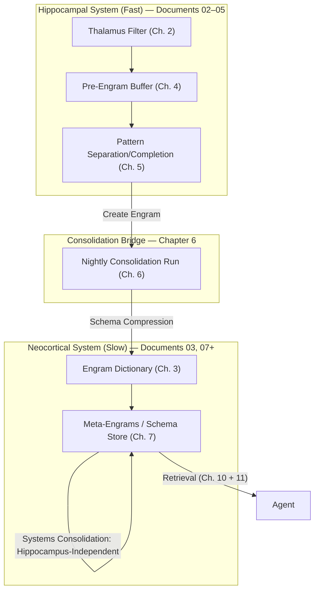

## 5. CLS and Catastrophic Interference in AI Systems

### The Problem in Classical Vector Stores

A single vector store that directly accepts all episodes has the same problem as a single neural network: new embeddings compete with old ones for retrieval resources. Older knowledge is not overwritten—but it is displaced. Retrieval quality for old knowledge decreases with each new input.

### The Problem in Monolithic Knowledge Graphs

A Knowledge Graph that is written directly and quickly with new information suffers from structural interference: new nodes and edges alter the traversal paths for existing knowledge. Old knowledge remains formally present—but the retrieval paths to it are disrupted by new structures.

### The CLS Solution in the Engram Architecture

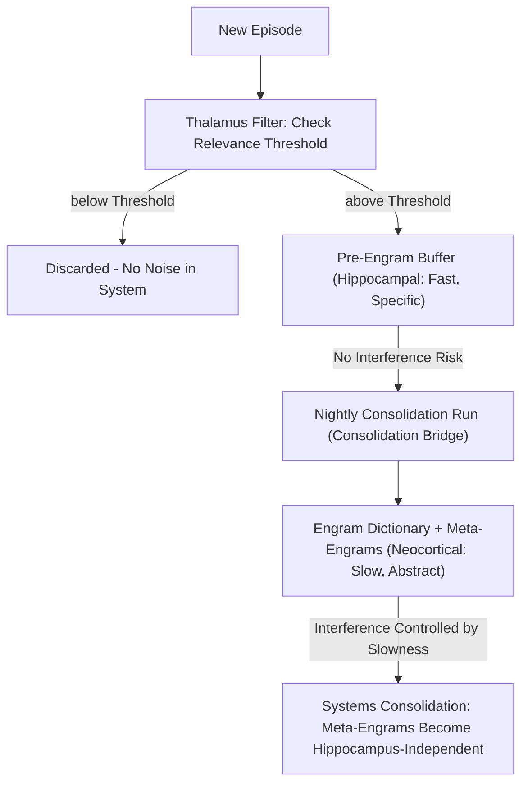

The separation of the two systems with a controlled consolidation bridge is the direct translation of the CLS principle to the Engram architecture. The Thalamus Filter as an upstream selection gate is the architectural enhancement that the brain solves through its own hippocampal selectivity.

---

## 6. Open Questions

- **Consolidation Frequency**: Solved through the trigger logic from Chapter 6—session-based as primary trigger, Engram threshold as overflow protection, time-based as fallback. The buffer won't overflow because the threshold trigger activates before it fills up.
- **Partial Consolidation**: Yes—episodes that do not exceed the Engram threshold in the Nightly Run intentionally remain only in the buffer and are replayed or deleted at the next opportunity. This corresponds to the biological principle: not every experience is consolidated—only what is important enough. The Thalamus Filter is the first selection, buffer decay the second.
- **Interference Measurement**: Indirect signal via the Adaptive Feedback Loop (cf. Chapter 5): if retrieval quality for existing Engrams in a domain systematically declines even though new Engrams of the same domain have been added, this indicates interference. Direct signal: compression is reversible—if a Meta-Engram produces worse results after compression than the source Engrams, the consolidation rate was too aggressive.

---

## 7. Summary

CLS is not another feature of the Engram architecture—it is the justification for the architecture. Without understanding Catastrophic Interference and the complementary solution through two separate systems, the separation of Pre-Engram Buffer and Engram Dictionary + Schema Store appears like an arbitrary design decision.

With CLS, it becomes clear: it is the only robust solution for persistent learning without loss of knowledge.

---

## Continuing in the System

The theoretical foundation is set. The architecture now needs its first concrete mechanism: a filter that decides what even enters the hippocampal system. Continue with the **Thalamus Filter** — Chapter 2.


---

# Thalamus Filter
## Relevance Scoring as Input Filter of the Engram Architecture


## Introduction

Everything begins with a gatekeeper.

---

## 1. Biological Foundation

In the human brain, the thalamus is the central relay between sensory organs and the neocortex. It receives nearly all sensory signals and decides — together with the prefrontal cortex — what is passed on at all. The vast majority of all incoming information is filtered at this level and never reaches the hippocampus.

This mechanism is not a loss — it is an energy-saving concept. The brain cannot process everything. By controlling the input, it protects downstream systems from overload and ensures that only relevant information enters the consolidation process.

The filter decision is based on:

- **Novelty** — is the signal unknown or unexpected?
- **Emotional Relevance** — has the amygdala marked the signal?
- **Attentional Focus** — what is the organism currently oriented towards?
- **Prediction Error** — does the signal deviate strongly from the current expectation?

Crucially: The thalamus **does not calculate these signals itself**. It receives them from specialized brain regions — hippocampus, amygdala, PFC, and the dopaminergic system — and integrates them into a gating decision. It is a lightweight integrator, not a calculator.

---

## 2. The Problem Without a Filter

In the existing Engram architecture, every Episode is evaluated without filtering and processed by the Nightly Consolidation Run. This leads to three problems:

**Noise in the System**
Irrelevant, redundant, or trivial Episodes burden the Nightly Consolidation Run and dilute the quality of the Engram Dictionary. The more noise, the worse the signal-to-noise ratio during the retrieval phase.

**Unnecessary Costs**
Embedding operations, similarity comparisons, and consolidation runs are computationally intensive. Without pre-filtering, these resources are wasted on worthless information.

**Schema Drift**
If too many weak or contradictory Episodes enter the consolidation process, the existing Schema can be destabilized — without any real learning effect behind it.

---

## 3. Concept: The Thalamus Filter

The Thalamus Filter is an upstream component that evaluates each incoming Episode before it enters the memory system. It works lightweight and fast — deliberately before expensive operations.

### 3.1 The Episode Object

An Episode is not raw, unstructured output. It is a complete object that arises only after an action has been fully executed and the result is available:

```
episode = {
  action,       // what was executed
  context,      // what state was the system in
  outcome       // what was the actual result
}
```

The expectation (`expected_outcome`) is not part of the Episode object — it lives in the active Session (see 3.2).

### 3.2 Session as PFC State

Before a caller can submit an Episode, a **Session** must be open. The Session is the equivalent to the active state of the prefrontal cortex — it records what the current goal is and what is expected.

```
session = {
  current_expectation,   // what does the agent expect as a result
  current_mode,          // Exploration / Routine / Critical
  task_context           // active Task context
}
```

The caller updates `session.current_expectation` when the Task changes. Without an open Session, a **Default Session** takes effect with neutral expectation and `mode = Exploration` — analogous to the brain's orientation mode when there is no active PFC context.

### 3.3 Position in the System

```
Caller opens Session (or Default Session takes effect)
        |
Episode is created: { action, context, outcome }
        |
[ THALAMUS FILTER ]
  receives: episode + active Session
        |
  in parallel: 4 Scores are calculated
        |
  Score >= Threshold?
        |                         |
   relevant                  irrelevant
        |                         |
Pre-Engram Buffer           discarded
```

### 3.4 Evaluation Dimensions and Their Origins

The Thalamus Filter does not calculate the four Scores itself — it receives them from specialized components, analogous to the corresponding brain regions. Since all necessary information is available at Episode input (Episode object + active Session), all four Scores can be calculated **in parallel**.

| Dimension | Question | Origin (Biology) | Origin (Architecture) |
|---|---|---|---|
| **Novelty** | Has this pattern been processed recently? | Hippocampus | Engram Dictionary (Recency-Check) |
| **Surprise** | Does the outcome differ from the expectation? | Dopaminergic System / VTA | `session.current_expectation` vs. `episode.outcome` |
| **Task-Relevance** | Does the Episode relate to the current Task? | Prefrontal Cortex | `session.task_context` |
| **Emotional Valence** | Did the Episode have a strong positive or negative outcome? | Amygdala | Valence assessment of `episode.outcome` |

The overall Score is a weighted sum of these four dimensions. Episodes below a defined threshold are discarded.

### 3.5 Threshold Modulation

The threshold is derived directly from `session.current_mode` and is not static:

**Exploration Mode** — low threshold
The agent is working in a new context or unknown domain. More information should enter the system, even if it is weak.

**Routine Mode** — high threshold
The agent executes known, recurring Tasks. Only strongly deviating Episodes are relevant.

**Critical Error** — threshold temporarily at zero
In case of unexpected errors or system states, the filter is deactivated — everything is stored. Analogy: shock state in humans, where the amygdala overrides all filters.

---

## 4. Distinction from Existing Components

The Thalamus Filter is **not a replacement** for the Engram Dictionary and not part of the Nightly Consolidation Run. It is conceptually upstream and operates on complete Episodes — before any embedding or comparison operation takes place.

| Component | Timing | Input | Output |
|---|---|---|---|
| Thalamus Filter | Immediately on input | Episode + Session | Yes/No + Score |
| Pre-Engram Buffer | After Filter | Filtered Episode | Accumulated Entry |
| Pattern Sep/Comp | At threshold | Buffer Entry | New or Update |
| Nightly Consolidation Run | Periodically | Pre-Engram Buffer Entries | Engram Dictionary Update |

---

## 5. Open Questions

- **Filter Architecture**: Rule-based (explicit thresholds per dimension) or a lightweight ML classifier trained on past consolidation decisions?
- **Feedback Loop**: Should the Nightly Consolidation Run provide feedback to the Thalamus Filter — learning which Episodes proved valuable after consolidation?
- **Transparency**: Should discarded Episodes be logged (with Score) to make the filter auditable?
- **Session Lifetime**: When is a Session closed? After a completed Task, after a timeout, or explicitly by the caller?
- **Multi-Session**: Can a caller have multiple parallel Sessions — and if so, which Session applies to an incoming Episode?

---

## 6. Diagrams

### 6.1 Component Diagram

The component diagram shows the static structure of the Thalamus Filter and its relationships to surrounding components. The caller opens a Session and submits Episodes. The Thalamus Filter is a pure integrator — it receives signals from the Session (PFC) and the Hippocampus and makes the gating decision from them. The Engram Dictionary lives within the Hippocampus, not as a standalone component.

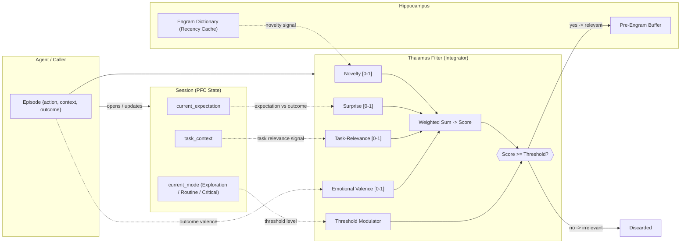

### 6.2 Sequence Diagram

The sequence diagram shows the dynamic flow of a single Episode through the Thalamus Filter. Central design principle: all four Scores are calculated in parallel — possible because the Episode object is already complete on input and the Session is always available. Surprise does not arise from the Episode itself, but from the comparison of `session.current_expectation` with `episode.outcome`.

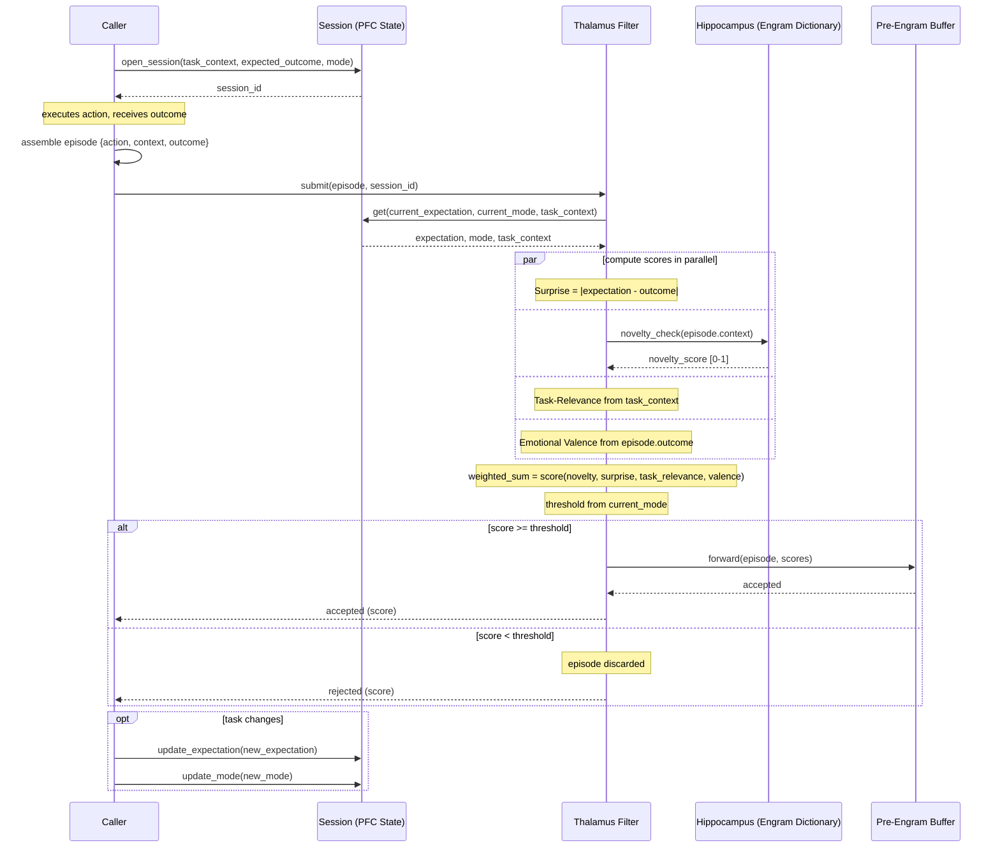

---

## 7. Summary

The Thalamus Filter is the prerequisite for the other three new mechanisms — Pre-Engram Buffer, Pattern Separation/Completion, and Nightly Consolidation Run — to work efficiently. It defines the quality of input for the entire downstream system.

Without it, the Pre-Engram Buffer accumulates noise. With it, it accumulates signal.

---

## Continuing in the System

The system has an input. The question is: what happens to the Episodes that come through the door? How does a fleeting experience become something lasting? This is explained by **Memory Engrams** — Chapter 3.


---

# Memory Engrams
## What an Engram is, how it arises, and what defines it at the neural level


## Introduction

The gatekeeper has decided: this Episode is worth it. Now we face the most fundamental question in memory research — what exactly is a memory? Not as a metaphor, but physically: what changes where so that something can be remembered?

---

## 1. Biological Foundation

### The Term

The term "Engram" was coined in 1904 by German zoologist Richard Semon — as a hypothetical physical substrate of a memory. For decades it remained speculative. Only with modern optogenetic methods could it be shown that Engrams are real, localizable, and manipulable.

The decisive research came from Susumu Tonegawa and his team at MIT (from 2012): They were able to identify specific neural ensembles that encode a particular memory, artificially reactivate these ensembles — and thus trigger the memory without the original experience. They could even implant false memories by reactivating Engrams in new contexts.

### Definition

An Engram is a **specific group of neurons** that were co-activated by an experience, thereby became synaptically connected to one another, and upon later reactivation — completely or partially — reconstruct the original experience.

Three properties define an Engram:

**Sparsity**
Only a small percentage of all neurons in a region are part of a specific Engram — typically 2-5%. This is not chance but active regulation through inhibition. Sparsity prevents overlap between different Engrams and enables Pattern Separation.

**Distribution**
An Engram is never in a single location. The different aspects of an experience — visual, auditory, emotional, spatial — are distributed across the cortex and connected through the hippocampus as a central index.

**Reactivatability**
The defining feature: an Engram can be reactivated — through part of the original stimulus, through an associated context, or through direct neural input. Reactivation reconstructs the experience.

---

## 2. How an Engram Arises

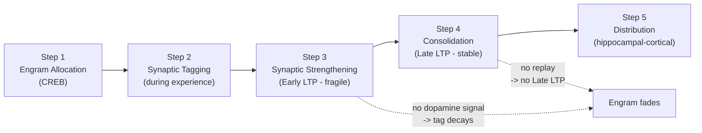

### Step 1 — Engram Allocation

Not every neuron is equally likely to be part of a new Engram. Allocation — which neurons form a new Engram — is regulated by the **CREB transcription factor**.

Neurons with elevated CREB activity at the time of an experience are preferentially incorporated into the new Engram. CREB activity is increased by **dopamine** and **noradrenaline** — both neurotransmitters released during emotionally significant or surprising events. This means: the higher the emotional valence and prediction error of an experience, the more likely it is to become an Engram.

In the architecture, this is the direct mechanism behind the Thalamus Filter Score ( Chapter 2): Emotional Valence and Surprise are the CREB drivers. A high Thalamus Score corresponds to a high CREB level — and thus a high allocation probability.

### Step 2 — Synaptic Tagging During Experience

Here lies an often-overlooked but crucial mechanism: marking happens **during** the experience, not after.

When neurons fire actively during an experience, they leave a **molecular tag** at their synapses — a temporary mark that signals: "this synapse was involved". The tag is biochemically a short-lived protein molecule anchored at the synapse.

This tag has two properties that are crucial for the system:

**Time-Limited** — the tag decays within hours if no consolidation follows. It is not a permanent marker, but a candidate flag.

**Capture-Capable** — if a strong dopamine/noradrenaline signal is released nearby (temporally or spatially), tagged synapses can "capture" the plasticity proteins that arise. This converts the fragile marking into a stable synaptic change.

This is the **Synaptic Tagging and Capture (STC)** mechanism — the biological foundation for why experiences remain available for later replay at all. Only tagged experiences can be consolidated. Untagged experiences disappear without a trace.

In the architecture, the tag corresponds to the **score-annotated Episode entry** in the Pre-Engram Buffer: the Episode is marked with its Thalamus Score (Novelty, Surprise, Task-Relevance, Emotional Valence), a timestamp, and the Session context. This annotated entry is the digital equivalent of the synaptic tag — it is what later becomes available for replay in the Consolidation Run.

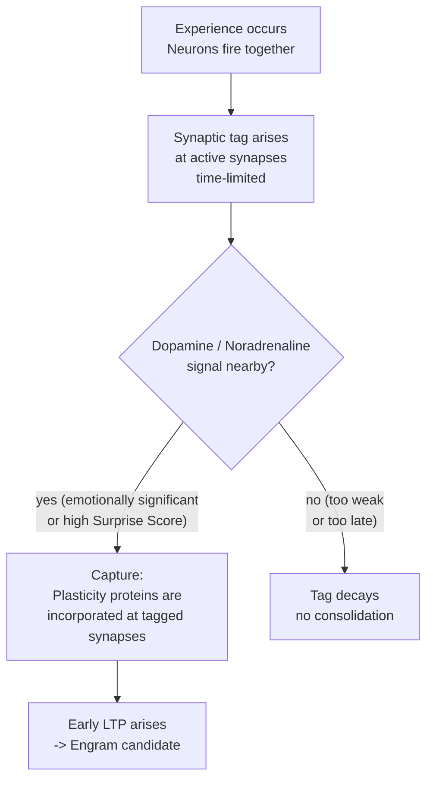

### Step 3 — Synaptic Strengthening (Early LTP)

The tagged neurons fire together — and through Hebbian learning, their synaptic connections are strengthened. This is the moment when the Engram physically arises: as a pattern of strengthened synapses between co-activated neurons.

In this early stage, the Engram is fragile — it exists as **Early LTP** (early long-term potentiation) that fades within hours without further consolidation.

### Step 4 — Consolidation (Late LTP)

A permanent Engram requires protein synthesis — new proteins must be built at the relevant synapses to convert Early LTP into **Late LTP** (late long-term potentiation). This is the consolidation step that converts a fragile trace into a stable representation.

Consolidation takes place on two levels:

**Synaptic Consolidation** — within hours, at the site of synapses. Local process.

**Systems Consolidation** — over days to weeks, through replay in sleep. The hippocampus repeatedly reactivates the Engram and gradually transfers it to the neocortex. After complete systems consolidation, the Engram is hippocampus-independent.

### Step 5 — Distribution

A mature Engram is distributed. The hippocampus holds the index — it knows which cortical regions are involved in the Engram. The actual contents lie distributed in the cortex: sensory details in sensory areas, emotional valence in the amygdala, spatial context in the entorhinal cortex, conceptual knowledge in the prefrontal cortex.

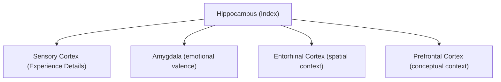

---

## 3. What an Engram Is Not

**Not a Complete Image**
An Engram is not a photograph of an experience. It is an activation pattern that enables reconstruction of an experience — not the experience itself. What was not encoded does not exist in the Engram.

**Not a Static Object**
An Engram changes with every retrieval — through reconsolidation, through new associations, through decay. It is a dynamic pattern, not a static dataset.

**Not Localized**
There is no single neuron that represents a concept. Knowledge is distributed. An Engram is the pattern — not the location.

---

## 4. Mapping to the Engram Architecture

### 4.1 The Engram as a Knowledge Unit

In the agent architecture, an Engram is the fundamental knowledge unit — analogous to the biological model. It represents accumulated knowledge about a specific situation, domain, or Task type.

| Biological | Concept in Architecture |
|---|---|
| Neural Ensemble | Structured knowledge unit with index |
| CREB Allocation | Thalamus Filter Score (Emotional Valence + Surprise) |
| Synaptic Tag | Score-annotated entry in Pre-Engram Buffer |
| Sparsity | Selective creation — not every Episode becomes an Engram |
| Early LTP | Fragile entry in Pre-Engram Buffer |
| Late LTP | Consolidated Engram after Consolidation Run |
| Hippocampal Index | Engram Dictionary Entry |
| Cortical Representation | Distributed content in episodic and Schema Storage |
| Systems Consolidation | Nightly Consolidation Run |

An Engram is not a single data structure — it is a distributed unit. The hippocampus holds only the index; contents live in separate stores:

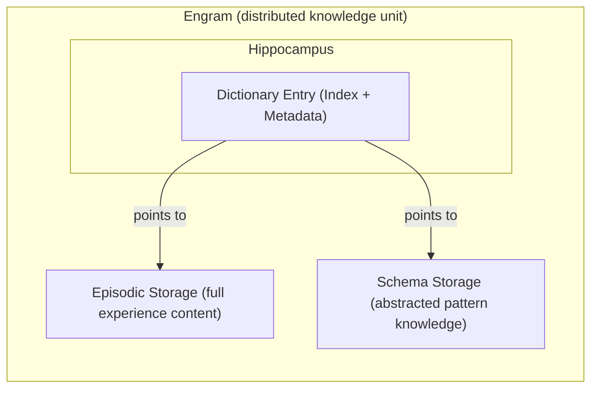

### 4.2 Structure of an Engram Dictionary Entry

The hippocampus holds the index — in the architecture, this is the Engram Dictionary Entry. It does not store the full content of an experience, but only the pointer to it and the metadata needed for retrieval and consolidation decisions:

```
engram_entry = {
  id,                  // unique identifier
  embedding,           // semantic vector for similarity search
  tags,                // thematic markers
  strength,            // accumulated strength (increases through retrieval and replay)
  thalamus_scores,     // Novelty, Surprise, Task-Relevance, Valence at creation
  created_at,          // timestamp of creation
  last_accessed,       // last retrieval
  access_count,        // how many times the Engram was retrieved
  session_ref          // reference to Session in which the Engram arose
}
```

The full content of the experience lives in **episodic storage** — the entry only points to it. The abstracted pattern knowledge lives in **Schema Storage**. The entry connects both.

**Versioning:** An Engram is not versioned — it is overwritten. This is the direct biological principle: with each retrieval, a reconsolidation window opens and the Engram can change. The original no longer exists afterward. What is preserved is the implicit access history through `last_accessed` and `access_count` — they show how often and when the Engram was used, without versioning the content. This keeps the architecture simple and biologically correct.

### 4.3 Sparsity as a Design Principle

The biological sparsity principle has a direct implication for the architecture: not every Episode should create its own Engram. The Thalamus Filter and the Pre-Engram Buffer are the mechanisms that enforce sparsity — they ensure that only truly significant patterns become Engrams.

Too many Engrams is not a sign of a good system — it is a sign that the sparsity mechanisms are failing.

### 4.4 Engram Identity

What makes two Engrams different Engrams and not one? The answer lies in the similarity threshold on the embedding vector: if a new Episode is sufficiently similar to the embedding of an existing Engram, it is treated as an update (Pattern Completion). If not, a new Engram is created (Pattern Separation).

Engram identity is thus not an inherent property of an Engram — it is a decision of the Pattern Separation/Completion mechanism based on embedding similarity. The exact threshold definition belongs in Chapter 5.

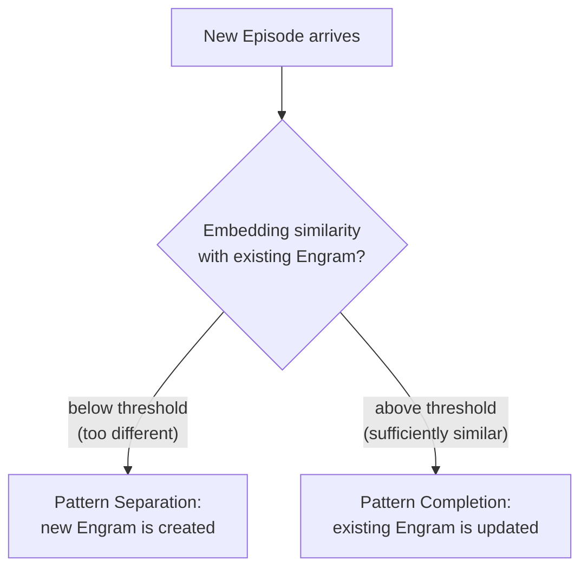

### 4.5 Engram Granularity

Engrams have no fixed granularity — it is emergent. An Engram starts as episodic (a single consolidated Episode) and can be compressed into a more abstract pattern through repeated consolidation.

The brain knows the same hierarchy: many similar episodic Engrams are compressed into Schema Engrams through systems consolidation — the specific fades, the structural remains.

In the architecture, this results in a natural hierarchy:

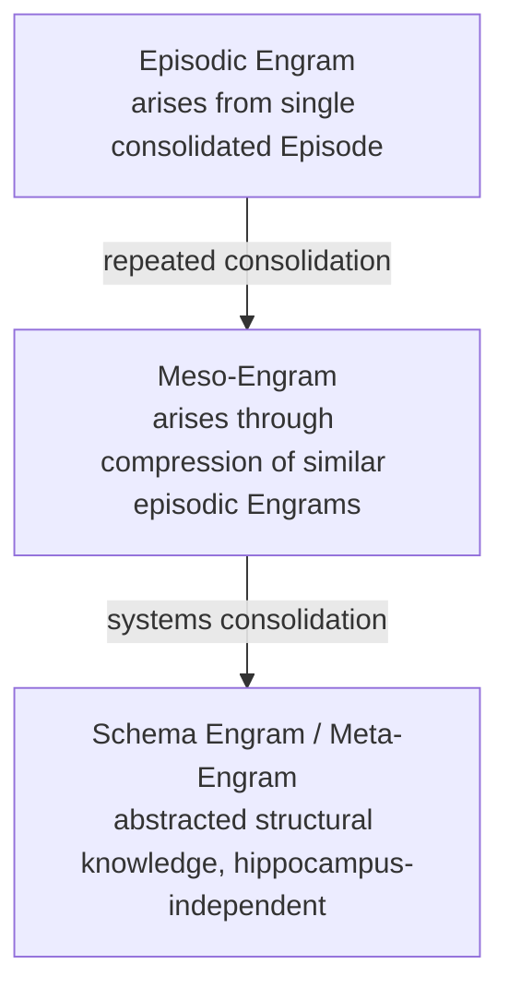

The granularity level of an Engram can be read from its `strength` value and `access_count`: an Engram with high strength and many accesses is a candidate for compression to the next level. Granularity is not a configuration parameter — it is a result of usage behavior.

The following diagram shows how an Engram matures horizontally through the layers — from raw Episode to stable Schema knowledge:

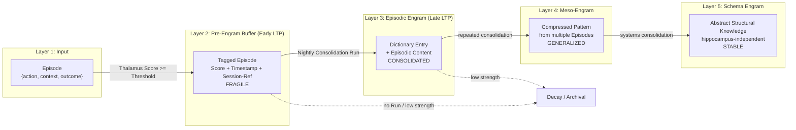

### 4.6 Engram Lifecycle in the Architecture

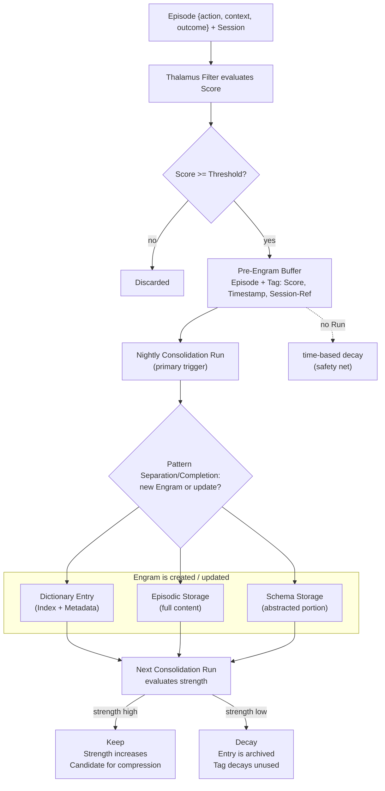

The primary trigger for decay and consolidation is the **Nightly Consolidation Run** — analogous to sleep in the brain. Between two runs, the Pre-Engram Buffer accumulates entries. During the run, it is decided what is consolidated and what decays. Time-based decay acts only as a safety net when no run occurs — an entry that remains untouched in the buffer long enough decays passively, just as a synaptic tag decays without protein synthesis.

---

## 5. Open Questions

- **Embedding Strategy**: Which embedding procedure represents semantic similarity between Engrams in such a way that Pattern Separation and Completion work reliably? This question is addressed in Chapter 5 (Pattern Separation/Completion).

---

## 6. Summary

Memory Engrams are not just a biological concept that inspires the architecture — they are the central knowledge unit of the entire architecture. All other documents describe either how Engrams arise, how they change, how they are consolidated, or how they are retrieved.

The synaptic tagging mechanism is the conceptual key here: it explains why the system separates experience from consolidation, why the Pre-Engram Buffer exists, and why not every Episode automatically becomes permanent. Without tagging, no selective replay. Without selective replay, no clean long-term memory.

Without a clear understanding of what an Engram is, the architecture lacks its conceptual center.

---

## Continuing in the System

An Engram has arisen — for Episodes that were strong enough. But what happens to experiences that barely pass the filter, too weak for an immediate Engram, but not meaningless? This is answered by the **Pre-Engram Buffer** — Chapter 4.


---

# Pre-Engram Buffer
## Accumulation of Weak Signals Below the Engram Threshold


## Introduction

Not every experience arrives loudly. Some patterns whisper — they appear once, disappear, reappear slightly changed. Individually, they are noise. Together, they tell a story.

The brain has a place for these quiet signals. A space that patiently waits, collects, and only acts when enough has accumulated.

---

## 1. Biological Foundation

In the hippocampus, the **dentate gyrus** performs a specific task: it receives incoming signals and evaluates whether they are strong enough to justify a complete Engram. Signals that do not reach this threshold do not disappear immediately — they leave minimal synaptic traces.

These traces accumulate silently in the background. Each repetition of the same pattern adds another trace. Only when cumulative strength exceeds a threshold is the pattern transferred to the active consolidation process.

This is the mechanism behind intuition: patterns that were never consciously perceived, but changed the schema through silent accumulation. The brain registers subtle repetitions over weeks and months — without ever explicitly storing them.

Additionally, the hippocampus has a second function: it keeps fresh complete Episodes temporarily available — with all details and full context — before deciding whether to consolidate them long-term. This intermediate storage is necessary so the Nightly Consolidation Run can access the full Episode content.

---

## 2. The Problem Without a Pre-Engram Buffer

The existing architecture knows only two states: an Episode is stored or it is discarded. This leads to a blind spot:

**Subtle Patterns Remain Invisible**
A mistake that occurs once is noise. The same mistake that occurs ten times in slightly varied form is a pattern — but only if the system tracks frequency over time. Without a buffer, this information is lost.

**No Gradual Learning**
Learning in the biological system is gradual — synaptic strength grows continuously. A binary storage system cannot represent this graduality. Either an experience is strong enough for an Engram, or it does not exist.

**No Intuition Formation**
Intuition arises from accumulated weak signals that were never individually relevant. Without an accumulation layer, no agent-equivalent intuition system can arise.

---

## 3. Concept: The Pre-Engram Buffer

The Pre-Engram Buffer is a persistent intermediate layer between the Thalamus Filter and the Engram Dictionary. It fulfills two complementary roles — analogous to the hippocampus's dual function as short-term storage and pattern detector.

**Role 1 — Episodic Short-Term Storage:** Complete Episodes are transferred from the Working Context (see Chapter 13) into the buffer after Task completion and held there until the Nightly Consolidation Run decides whether to create a permanent Engram. The content is narrative and contextful — a complete Episode with action, context, and outcome.

**Role 2 — Pattern Accumulator:** Episodes that pass the Thalamus Filter but are individually too weak for an Engram leave a distilled pattern entry. This entry has no narrative content — it is a statistical aggregate across many similar Episodes.

> **Relationship to the Nightly Consolidation Run (Ch. 4):** Phase 1 of the NCR acts on both roles simultaneously — it applies decay to episodic short-term entries and runs strength-proportional replay on pattern accumulator entries that are close to the Engram threshold. Both roles are consolidated through the same mechanism; the difference is only in what gets replayed: full Episodes (Role 1) or distilled pattern aggregates (Role 2).

### 3.1 Position in the System

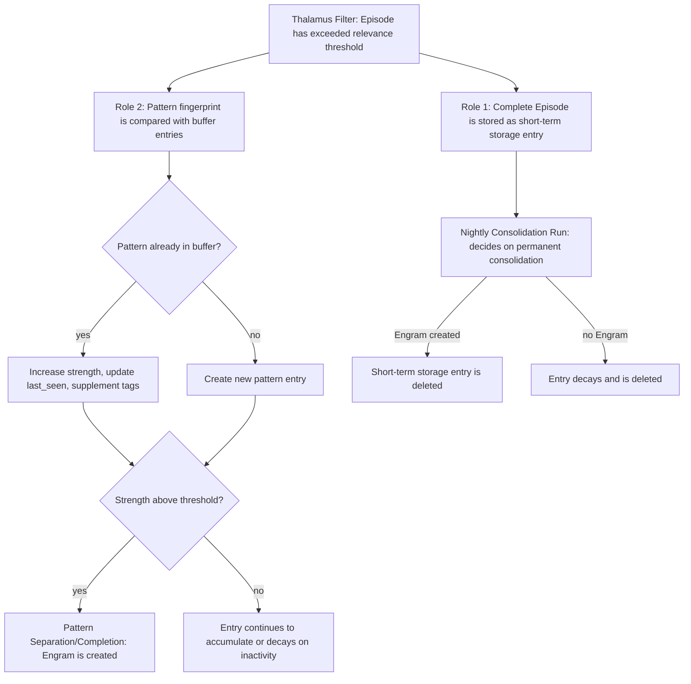

### 3.2 Structure of a Pattern Entry

Each pattern entry in the Pre-Engram Buffer represents a recurring pattern — not a single experience:

| Field | Description |
|---|---|
| `pattern_hash` | Unique fingerprint of the pattern (embedding-based, ANN-compatible) |
| `occurrences` | Number of activations since creation |
| `strength` | Accumulated strength value (0.0 – 1.0) |
| `first_seen` | Timestamp of first activation |
| `last_seen` | Timestamp of last activation |
| `context_tags` | All contextual tags from contributing Episodes |
| `threshold` | Target value for Engram creation (domain-adaptive) |
| `decay_rate` | Decrease rate on inactivity — modulated by valence_score and surprise_score (see Chapter 6) |
| `source` | `ACCUMULATED` — marks Engrams that arise from this path for Source Monitoring (see Chapter 10) |

### 3.3 Accumulation Logic

When a new Episode passes the Thalamus Filter, its pattern is compared via ANN search with existing buffer entries (cosine similarity > configurable similarity threshold = same pattern):

**Pattern Already in Buffer** — Strength is increased, `last_seen` updated, context tags supplemented. The increase is not linear — it is weighted by the Episode's Surprise Score. A surprising repetition increases strength more than an expected one.

**Pattern Not Yet in Buffer** — New entry is created with initial strength proportional to the Episode's Thalamus Score.

**Strength Exceeds Threshold** — Entry is passed to Pattern Separation/Completion. Buffer entry is deleted after successful Engram creation. The resulting Engram carries `source: ACCUMULATED` — the retrieval layer and Source Monitoring can use this to signal that this knowledge comes from pattern accumulation, not a single strong experience.

### 3.4 Decay Mechanism

Buffer entries that remain inactive for a defined period continuously lose strength. This prevents obsolete patterns from eventually triggering an Engram even though they are no longer relevant.

The decay rate is not fixed — it is modulated by the emotional and surprising quality of contributing Episodes (analogous to Chapter 6): entries with high valence_score or surprise_score decay more slowly.

Strength over time = Initial_strength × e^(−decay_rate × Days_inactive)

When strength falls below a minimum value, the entry is deleted. The pattern has not repeated often enough to be relevant.

### 3.5 Strength-Proportional Replay

Analogous to biological sleep replay, buffer entries receive periodic replay during the Nightly Consolidation Run — strength-proportional, not stochastic (see Chapter 6). Stronger entries are replayed more frequently; very weak entries can go through long periods without replay.

This serves two purposes:

**Reinforcement** — Strong entries that are just below the threshold are pushed over the limit through replay even if no new Episode activates them.

**Pattern Fusion Across Entries** — The replay process can recognize similarities between multiple buffer entries and consolidate them into a stronger shared entry. This is how more abstract patterns arise from multiple weak signals.

### 3.6 Buffer Size Management

The buffer has a defined size budget. Two mechanisms keep it bounded: the decay mechanism automatically deletes inactive entries. If the budget is exceeded anyway, LRU-eviction kicks in (analogous to Chapter 6 archive management) — weakest and longest-inactive entries are removed first.

---

## 4. Distinction from Working Context

The Working Context (see Chapter 13) and the Pre-Engram Buffer are closely connected but conceptually different:

| Aspect | Working Context (Episodic Buffer) | Pre-Engram Buffer |
|---|---|---|
| Content | Complete running Episodes | Short-term storage: complete Episodes; pattern layer: distilled aggregates |
| Lifetime | Task duration | Until consolidation or decay |
| Granularity | Single event, ongoing | Single event (short-term storage) or aggregate across many events (pattern layer) |
| Purpose | Active coordination during Task | Episodic intermediate holding and pattern accumulation |
| Temporality | Present | Past (after Task completion) |

The Working Context writes to the Pre-Engram Buffer — it is the producer, the buffer is the recipient.

---

## 5. Open Questions

- **Pattern Hashing**: Solved through ANN search with configurable similarity threshold (cosine similarity). The tolerance radius is not a fixed value — it is calibrated over time via the adaptive feedback loop from Chapter 5 (Completion Threshold). Engrams that arise from buffer accumulation and are frequently retrieved signal: threshold was well-chosen. Engrams that are never used: threshold was too wide.
- **Threshold Calibration**: Solved through derivation from the Completion Threshold ( Chapter 5). The buffer threshold is not a separate parameter — it is a function of the domain-adaptive Completion Threshold. When the Completion Threshold decreases in a domain (Pattern Completion becomes easier), the buffer threshold also decreases proportionally.
- **Buffer Size**: Solved through combination mechanism (section 3.6): decay as primary cleanup mechanism, LRU-eviction as safety net if budget is exceeded anyway. The budget itself is configurable — it defines the maximum number of simultaneously active pattern entries.
- **Transparency**: Deliberately opaque — analogous to the unconscious. The agent has no direct read access to buffer entries. It only notices the result: an Engram arises that comes from silent pattern learning. This origin is made visible through the `source: ACCUMULATED` flag — Source Monitoring ( Chapter 10) can use this to signal that this knowledge was inferred, not directly experienced.

---

## 6. Summary

The Pre-Engram Buffer closes the conceptual gap between discarding an Episode and creating a complete Engram. It is the foundation for gradual learning, intuition formation, and recognition of subtle patterns over long periods.

Without it, the system is reactive — it learns only from strong, unambiguous signals. With it, the system becomes proactive — it recognizes patterns before they become explicit, and keeps complete Episodes long enough so the Nightly Consolidation Run can make well-founded decisions about their long-term relevance.

---

## Continuing in the System

The buffer accumulates patterns and keeps fresh Episodes ready. But eventually the system must decide: does a new Episode belong to something known — or is it truly new? This is the task of **Pattern Separation/Completion** — Chapter 5.


---

# Pattern Separation / Completion
## Decision Logic Between New Engram and Expansion of an Existing One


## Introduction

The system has filtered, stored, and accumulated episodes. But memory alone is of little value if you cannot retrieve what is stored—and cannot distinguish what is known from what is truly new.

Imagine a library that receives new books daily, without a catalog, without a shelf system. Eventually, searching becomes impossible. The brain has two elegant solutions for this problem: it separates similar things from each other, and it completes what is incomplete—simultaneously, depending on context.

---

## 1. Biological Foundation

### The Hippocampal Circuit

Four structures work together in the hippocampus to decide what happens to a new pattern. The **Entorhinal Cortex (EC)** is the central gateway for input and output—all information enters and leaves the hippocampus through it.

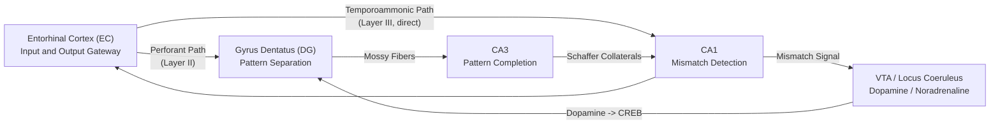

**Entorhinal Cortex (EC) — The Gateway**
The EC is the entrance and exit of the entire hippocampus. It sends new information in via two pathways: once via the long route through DG and CA3 (for deep processing and encoding), and once directly to CA1 (as a fast reality feed). This direct pathway is deliberately hard to modify—it should remain a stable mirror of current reality, not colored by memories.

**Gyrus Dentatus (DG) — The Separator**
The DG takes the input from the EC and makes it extremely sparse: from a broad, overlapping input signal, it creates distinct, non-overlapping patterns. Only 2-4% of all neurons are active for a given pattern. This happens through active competition—the most strongly activated neurons suppress their neighbors. The winner takes all; all others are silenced. The result: two similar experiences land in completely different neural patterns and cannot accidentally be confused.

**CA3 — The Completer**
CA3 is the opposite of DG: it is specialized in reconstructing the whole from a fragment. Each CA3 neuron is connected to many other CA3 neurons—the network knows itself. When a known pattern is activated only partially, the network pulls the rest from memory. This mechanism makes associative recall possible: a partial cue is enough to activate the complete memory.

**CA1 — The Arbiter**
CA1 receives two signals simultaneously: what CA3 just completed from memory, and what the EC reports as current reality. CA1 compares the two. If they match—no problem, the memory fits the situation. If they diverge significantly—CA1 raises an alarm. This mismatch signal triggers the release of dopamine and noradrenaline, which in turn increases the system's willingness to create a new, separate Engram. This is the direct biological origin of the Novelty and Surprise scores in the Thalamus Filter ( Chapter 2) and the CREB allocation from Chapter 3—all three documents describe the same control loop from different angles.

### The Balance Between Separation and Completion

Too much separation means: the system learns a lot, but nothing hangs together. Each experience remains an island. Too much completion means: the system generalizes too strongly and always presses what is new into old patterns—true learning no longer occurs. The brain actively maintains this balance through three mechanisms:

**Situation-dependent switching** — Depending on the state, the brain releases more or less acetylcholine. A high level means: we are in a new situation, separate patterns cleanly from each other. A low level means: we are retrieving known knowledge, complete rather than separate. The system thus dynamically switches between learning and retrieval mode.

**Long-term adaptation through new neurons** — Over weeks and months, the brain adjusts its separation capacity: in phases with much new input, more new neurons are created in the DG, which increases separation sharpness. This is a slow, structural adaptation to environmental demands.

**Context-sensitive input** — The EC regulates how strongly it preprocesses the input signal: for very similar inputs, it actively amplifies the differences before the information reaches the DG. The system thus already recognizes at input whether separation is particularly important.

---

## 2. The Problem Without This Mechanism

The existing architecture describes Engram creation, but not the decision-making process behind it. This leads to two possible errors:

**Engram explosion (too much separation)**
Every new episode creates its own Engram. The Engram Dictionary grows uncontrollably. Similar knowledge is not consolidated—the agent must load many similar Engrams on each retrieval instead of one abstract, strong Schema.

**Schema overwriting (too much completion)**
New episodes are always integrated into the most similar existing Engram. Genuine differences are lost. Subtle but important variants of the same pattern cannot be separately represented.

---

## 3. Concept: Pattern Separation / Completion

The mechanism comes into effect when a Pre-Engram Buffer entry reaches its threshold and is passed on for Engram creation. It decides: will a new Engram be created, or will an existing one be expanded?

### 3.1 Position in the System

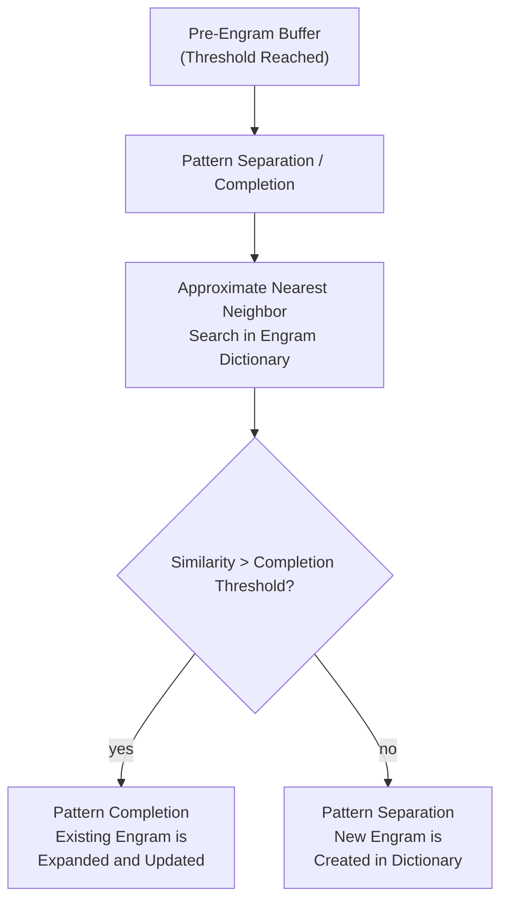

### 3.2 The Decision Process

**Step 1 — Sparse Embedding Search**
The buffer entry is represented as an embedding. Comparison with existing Engrams is not exhaustive—comparing against all entries would become prohibitively expensive as the Dictionary grows. Instead, **Approximate Nearest Neighbor (ANN)** is used: a fast, approximate search procedure that finds the k most similar Engrams without scanning the entire Dictionary. This is the architectural equivalent of parallel, sparse activation in the DG.

**Step 2 — Threshold Check**
The maximum similarity score of the k candidates is checked against the Completion threshold. If it exceeds the threshold, the most similar Engram is selected for Completion.

**Step 3a — Pattern Completion**
The existing Engram is enriched with the new information: new Context Tags are added, strength increases, existing content is not overwritten but supplemented. The Engram becomes wider, not replaced deeper.

**Step 3b — Pattern Separation**
A new Engram is created in the Dictionary with an initial strength score, the Context Tags from the buffer entry, and a **kinship reference** to the most similar existing Engram. Even in Separation, kinship is relevant—it forms the basis for associative Retrieval.

**Conflict Resolution**
What happens when a buffer entry is roughly equally similar to two different existing Engrams? Biologically, CA3 solves this through winner-takes-all competition among recurrent collaterals—the strongest activated pattern wins. In the architecture: in case of a tie, `strength` decides—the Engram with the higher strength score wins Completion. In case of a genuine tie, Separation occurs.

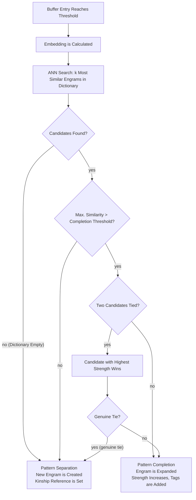

### 3.3 The Completion Threshold

The threshold is the central control mechanism and is modulated at four levels:

**Cholinergic Modulation (Mode)**
Analogous to acetylcholine regulation in the brain: in Exploration mode (Session `mode = Exploration`), the threshold is low—the system separates more and creates new Engrams. In Routine mode (`mode = Routine`), the threshold is high—the system completes and compresses existing Schemas. This is the direct mapping to the Session from Chapter 2.

**Engram Age**
Very young Engrams have an increased separation bias—they have not yet proven themselves and should not be immediately burdened with new information. Mature Engrams with high `access_count` can tolerate more Completion.

**Surprise Score of Buffer Entry**
Was the accumulated pattern surprising? Then the threshold is temporarily lowered: the system prefers Separation because the new information is clearly really different.

**Similarity Gradient of Input**
If the input embedding lies very close to an existing Engram but is simultaneously highly distinct from all others, Completion is preferred. With diffuse similarity across multiple candidates, Separation occurs.

**Adaptive Feedback Loop**
The threshold is not static—it learns from retrieval quality.

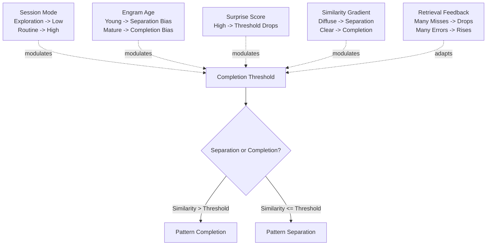

Analogous to the CA1 mismatch signal in the brain, the retrieval phase provides feedback to the mechanism: too many retrieval misses (the sought Engram is not found) indicate too much Separation—the threshold rises. Too many false Completions (wrong Engram was activated) indicate too much Completion—the threshold falls. As a first approach, a simple rule-based feedback loop is sufficient; more sophisticated adaptive learning is a later expansion stage.

### 3.4 Kinship References

In Pattern Separation, a reference is created between the new and most similar existing Engram. These references form over time a network of related Engrams—analogous to the Schema structure in the neocortex.

**Reference Depth:** Each Engram stores at creation only a Depth-1 reference—the direct pointer to the most similar Engram at the time of Separation. Deeper traversal occurs during Retrieval, not during storage: when Engram A is loaded, the Engrams that A points to can also be activated with a reduced threshold. And from there one step further again. The depth of associative Retrieval is thus dynamic and context-dependent—not predetermined. This is simple, scalable, and biologically correct.

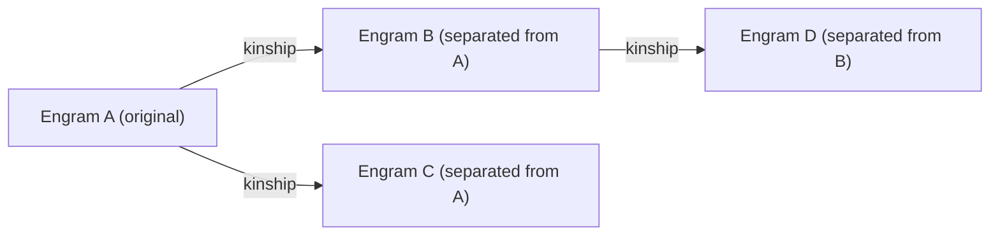

When Engram B is activated during Retrieval, A and D can be reloaded with a reduced threshold. This creates associative retrieval without explicit depth structure.

---

## 4. Distinction from Schema Compression in the Nightly Consolidation Run

Pattern Separation/Completion operates at the single-event level—at each Engram creation. Schema Compression in the Nightly Consolidation Run operates at the population level—it examines the entire Engram Dictionary and consolidates clusters of similar Engrams retroactively.

Both mechanisms are complementary: Separation/Completion decides at the moment of creation. Schema Compression corrects and optimizes over time.

| Aspect | Pattern Sep/Comp | Schema Compression |
|---|---|---|
| Timing | At Engram Creation | Periodically, Offline |
| Granularity | Single Engram | Population of Engrams |
| Direction | Forward (new -> Dictionary) | Backward (Dictionary -> abstract) |
| Result | New or Expanded Engram | Meta-Engram from Cluster |

---

## 5. Open Questions

- **ANN Method**: Which Approximate Nearest Neighbor method best fits the Engram Embedding structure? HNSW, Annoy, FAISS? This depends on scalability and latency requirements and will only be decided at implementation.
- **Embedding Strategy**: The direction is clear—a composite embedding combining the semantic content of the episode with the task context from the Session. Which specific model and component weighting is optimal remains open until implementation.

---

## 6. Summary

Pattern Separation/Completion is the mechanism that decides whether the system learns or generalizes. Without it, the Engram Dictionary is either an unstructured archive or an over-compressed Schema without nuance.

The CA1 mismatch mechanism directly connects this document to previous ones: the mismatch signal is the biological source of the Novelty and Surprise scores in the Thalamus Filter ( Chapter 2), and Dopamine-CREB is the molecular mechanism behind Engram allocation ( Chapter 3). The three documents thus describe a closed control loop: Thalamus filters, Engrams form, Pattern Sep/Comp structures the Dictionary.

With it, the Dictionary grows intelligently—it separates where differences matter, and completes where commonalities prevail.

---

## Continuing in the System

The system can store and classify. But right now, a fundamental question arises: Can a system learn something new quickly without destroying what is old? This is the hardest problem in AI memory research—and the brain has an elegant answer. Continue with **Complementary Learning Systems**—Chapter 1.


---

# Nightly Consolidation Run
## Active Forgetting, Decay, and Schema Compression as a Quality Mechanism


## Introduction

The system can store, accumulate, and retrieve. But memory is not static—it changes over time. Some Engrams grow stronger. Some fade. Some are compressed into more abstract knowledge.

Every night, the brain does something remarkable: it sorts the day. Not passively—actively. This is the mechanism that transforms an accumulating store into a learning system. Without night, there is no clear day.

---

## 1. Biological Foundation

Forgetting is not a failure of the memory system—it is an active, necessary process. Without targeted deletion and restructuring, the brain would drown in its own noise.

During sleep, the brain goes through two relevant phases:

**Slow Wave Sleep (SWS / Deep Sleep)**
The hippocampus replays the day's experiences in compressed form—10 to 20 times faster than the original. The neocortex receives and integrates these replays. What is reactivated enough times is strengthened. What is not reactivated begins to fade.

The concrete mechanism behind this are **Sharp Wave Ripples (SWRs)**—brief coordinated waves of activation in the hippocampus that repeat experience sequences in compressed form. Replay is not a uniform process but active selection.

Critical: What is replayed depends on how strong an Engram is and how important it was. Engrams with high strength scores (cf. Chapter 3) are reactivated more frequently. Content with high Surprise or Valence scores from the Thalamus Filter (cf. Chapter 2) receives preferred treatment. The brain does not repeat everything—it repeats what matters.

**REM Sleep**
Memories are not only repeated but recombined. REM sleep actively searches for patterns and connections between different episodes and extracts more abstract Schemas from them. Details fade—the underlying structure remains and is strengthened.

Additionally, there is **Synaptic Homeostasis** (Tononi): During the day, synapses are continuously strengthened through learning. Eventually, all synapses become nearly maximally strong—the system loses discrimination ability. During sleep, all synapses are globally weakened, but not uniformly. Strong connections remain strong. Weak ones fall below the maintenance threshold and are effectively deleted.

The result: the signal-to-noise ratio is restored. What is truly important becomes more prominent.

---

## 2. The Problem Without Active Cleanup

A memory system that only accumulates and never cleans up degenerates over time:

**Dictionary Inflation**
The Engram Dictionary grows unboundedly. Retrieval operations become slower. The context overhead per agent call increases. Eventually, the system becomes too heavy for practical use.

**Schema Dilution**
Many similar Engrams for the same domain compete during retrieval. No single Engram is strong enough to provide clear signal. The quality of the retrieval phase declines.

**Outdated Knowledge**
Engrams that were created early but never retrieved again remain active. They can be incorrectly loaded during retrieval and bring outdated or superseded information into the agent context.

**No Abstraction Progress**
Without compression, knowledge remains at the episodic level. The system learns no abstract Schemas—it only remembers individual cases.

---

## 3. Concept: The Nightly Consolidation Run

The Nightly Consolidation Run is a periodically running background process that optimizes the entire memory system in three phases. The "nightly" in the name is borrowed from neuroscience — it refers to the biological process that happens during sleep. In the AI architecture, this process is not bound to a clock: it runs after each Session, on a configurable schedule, or when the Engram threshold is reached. The biological metaphor describes the *function*, not the timing.

The run has access to completed Sessions (cf. Chapter 2). Each Engram carries a `session_ref` (cf. Chapter 3)—this tells us in which mode and with which `task_context` an Engram was created. This information flows into replay prioritization: Engrams from Sessions with `mode = Critical` or high `task_relevance` scores receive elevated replay priority. This corresponds to the biological finding that goal-relevant content is preferentially consolidated during sleep.

### 3.1 Position in the System

```mermaid
flowchart TD
    T["Trigger (Session End / Time / Engram Threshold)"]
    T --> P1

    subgraph NCR["Nightly Consolidation Run"]
        P1["Phase 1: Pre-Engram Buffer Decay"]
        P2["Phase 2: Engram Strength Decay + Archiving"]
        P3["Phase 3: Schema Compression"]
        P1 --> P2
        P2 --> P3
    end

    P3 --> OUT["Optimized Dictionary + Archive + Meta-Engrams"]
```

### 3.2 Phase 1 — Pre-Engram Buffer Decay

The buffer is cleaned up. Entries that have not been activated over a defined period lose strength according to the decay formula:

```
New Strength = Current Strength x e^(−decay_rate x Days_Since_Last_Activation)
```

The `decay_rate` is not uniform but individually modulated per entry: a high `valence_score` or `surprise_score` from the Thalamus Filter (cf. Chapter 2) lowers the decay rate—meaningful or surprising content fades more slowly. The base rate is configurable system-wide; the score is the modulator.

Entries that fall below the minimum value are deleted. They have not repeated often enough to be relevant. This is not information loss—it was never information, just potential noise.

Entries that are just below the Engram threshold receive **strength-proportional replay**: Analogous to biological Sharp Wave Ripples, where stronger synaptic patterns are reactivated more frequently, each borderline case is assigned a replay probability proportional to its current strength. During replay, the entry is treated as if a new episode with identical content had arrived. Subtle but persistent patterns thus get a final chance to exceed the Engram threshold.

The `session_ref` of the original entry determines the replay weighting: entries from Critical Sessions or with high task_relevance scores receive elevated replay priority.

```mermaid
flowchart TD
    E["Buffer Entry"] --> D["Calculate New Strength (Decay Formula + decay_rate Modulation)"]
    D --> C1{"Strength Below Minimum?"}
    C1 -->|yes| DEL["Delete Entry"]
    C1 -->|no| C2{"Close to Engram Threshold?"}
    C2 -->|no| KEEP["Keep in Buffer"]
    C2 -->|yes| W["Determine Replay Probability (Strength x session_ref Weight)"]
    W --> R["Strength-Proportional Replay: Treat Entry as New Episode"]
    R --> C3{"Threshold Exceeded?"}
    C3 -->|yes| NEW["Create Engram (Continue to Ch. 2)"]
    C3 -->|no| KEEP2["Keep in Buffer"]
```

### 3.3 Phase 2 — Engram Strength Decay & Archiving

Existing Engrams in the Dictionary are evaluated by activation frequency. Engrams that have not been retrieved for a defined time lose strength.

**Three possible outcomes per Engram:**

| State | Condition | Action |
|---|---|---|
| Active | Strength > active_threshold | Remains in Dictionary, no action |
| Weakened | archive_threshold < Strength <= active_threshold | Remains in Dictionary with reduced retrieval weight |
| Archived | Strength <= archive_threshold | Moved from active Dictionary to Archive |

Archived Engrams are not deleted—they are deactivated. They can be reactivated if explicitly needed, but do not burden the normal retrieval process.

```mermaid
flowchart TD
    E["Engram in Dictionary"] --> D["Calculate New Strength (Decay Since Last Retrieval)"]
    D --> C1{"Strength > active_threshold?"}
    C1 -->|yes| ACTIVE["Remain Active - No Action"]
    C1 -->|no| C2{"Strength > archive_threshold?"}
    C2 -->|yes| WEAK["Weaken - Reduced Retrieval Weight"]
    C2 -->|no| ARCHIVE["Move to Archive - Remove from Active Dictionary"]
```

### 3.4 Phase 3 — Schema Compression

This is the most demanding phase. The Consolidation Run analyzes the active Dictionary for clusters of similar Engrams and combines them into more abstract Meta-Engrams.

Phase 3 runs **incrementally**: not all Engrams are reclustered, but only those newly created since the last run and their nearest neighbors in embedding space. Existing Meta-Engrams that have not gained new neighbors are left untouched. This keeps computational effort proportional to the delta, not the total Dictionary size.

**Cluster Identification**
New Engrams are compared by embedding similarity and shared Context Tags with existing Engrams. A cluster is identified when several Engrams exhibit high mutual similarity and are frequently retrieved together.

**Meta-Engram Creation**
From a cluster, a Meta-Engram is extracted that represents the shared abstract structure. The Meta-Engram contains:
- The intersection of Context Tags from all cluster members
- A higher initial strength score (aggregated from the cluster)
- References to all source Engrams

Source Engrams are not deleted—they are degraded to instances of the Meta-Engram. Their retrieval priority declines. The Meta-Engram becomes the primary access point for this knowledge area.

**Preventing Catastrophic Interference**
Schema Compression carries the risk that important nuances are lost in abstraction. Three mechanisms prevent this:

First, source Engrams are retained as instances and can be explicitly loaded if needed. Second, Engrams with high Surprise scores—those representing an unexpected deviation from the pattern—are not included in compression. They are too important as exceptions. Third, Schema Compression is reversible: if a Meta-Engram produces poor retrieval results, it can be dissolved and source Engrams reactivated.

**Quality Control Through Adaptive Feedback Loop**
A separate validation system is not needed. The Adaptive Feedback Loop from Chapter 5 takes on this role: if a Meta-Engram repeatedly produces poor retrieval results, its strength score drops. Over the next Phase 2, it lands in the archive. Poor compression corrects itself—through use, not through explicit checking.

```mermaid
flowchart TD
    START["New Engrams Since Last Run"] --> ANN["ANN Search: Nearest Neighbors in Embedding Space"]
    ANN --> C1{"Similar Engrams Found?"}
    C1 -->|no| SKIP["No Cluster - Engram Remains Single"]
    C1 -->|yes| C2{"High Surprise Score?"}
    C2 -->|yes| EXCL["Exclude from Compression - Exception Retained"]
    C2 -->|no| CLUSTER["Form Cluster (Embedding Similarity + Shared Tags)"]
    CLUSTER --> META["Create Meta-Engram (Tag Intersection + Aggregated Strength)"]
    META --> DEGRADE["Degrade Source Engrams to Instances"]
    DEGRADE --> FB{"Meta-Engram Produces Poor Retrieval Results?"}
    FB -->|yes| DISSOLVE["Dissolve Meta-Engram - Reactivate Source Engrams"]
    FB -->|no| KEEP["Meta-Engram Remains Primary Access Point"]
```

---

## 4. SWS and REM as Two Phases

The three phases of the Nightly Consolidation Run map directly to biological sleep phases:

| Biological | Mechanism | AI Equivalent |
|---|---|---|
| SWS — Sharp Wave Ripples | Repetition of important sequences, weighted by strength and significance | Phase 1: Buffer Replay, Phase 2: Decay Selection |
| Synaptic Homeostasis | Global weakening—Strong remains, weak falls away | Phase 2: Strength Decay with Archiving Threshold |
| REM — Pattern Recombination | Condensing commonalities from individual cases into abstract patterns | Phase 3: Schema Compression |

All three are necessary. Decay alone without compression leaves a thinned Dictionary without an abstraction level. Compression alone without decay leads to Meta-Engrams based on outdated sources.

---

## 5. Trigger Logic

When does the Consolidation Run execute? Three possible trigger strategies:

**Session-based** — The run executes after each completed agent Session. Closest to biological analogy—sleep follows waking. The Session directly provides context for replay prioritization in Phase 1.

**Threshold-based** — The run is triggered when a defined number of new Engrams have been created or when the Dictionary exceeds a certain size. More efficient for long Sessions with many Engrams.

**Time-based** — The run executes at fixed intervals as fallback when no Session boundaries are identifiable.

The combination of session-based as primary trigger and time-based as fallback most closely mirrors the biological rhythm.

---

## 6. Open Questions

- **Decay-Rate Calibration**: Base rate is configurable and modulated per Engram through `valence_score` and `surprise_score` (incorporated in Phase 1). Domain-specific rates are possible but are an implementation detail—not a conceptual matter.
- **Compression Quality**: No separate validation system. The Adaptive Feedback Loop from Chapter 5 takes the role: poor Meta-Engrams weaken themselves through retrieval failure (incorporated in Phase 3).
- **Archive Management**: The archive has a configurable maximum size. If exceeded, the oldest and least-accessed entries are permanently deleted—LRU principle. Biological equivalent: synaptic pruning.

---

## 7. Summary

The Nightly Consolidation Run is the mechanism that keeps the memory system alive. Without it, the Engram architecture is an accumulating system—with it, it is a learning system.

Forgetting, decay, and compression are not weaknesses—they are the prerequisite for signal and noise to remain distinguishable. A system that weights everything equally has understood nothing.

---

## Continuing in the System

Consolidation polishes individual episodes. But what emerges when enough episodes have been consolidated? Deeper understanding—the transition from facts to structures and expectations. This is described by **Schema Theory**— Chapter 7.


---

# Schema Theory
## Dynamic Knowledge Structures as Foundation for Agent-Based Cognition


## Introduction

Knowledge has two forms. The first: you know that Paris is the capital of France. The second: you understand why capital cities are political power centers, and can deduce what happens in a city that becomes a capital.

The first is a fact. The second is a schema. Consolidation wears down individual episodes until what is common becomes visible. This chapter traces how the architecture moves from fact-gathering to understanding — and what happens when a schema is wrong.

---

## 1. Biological Foundation

A schema is not a single memory and not an isolated fact. It is an **expectation structure** — a network of accumulated knowledge that says: if X, then probably also Y and Z.

Schemas emerge through repeated experience. The brain extracts what remains constant across many episodes and discards what was coincidental. A person who has been in restaurants a hundred times doesn't remember every single evening — but they know precisely what a restaurant is, how it works, and what to expect. This structured expectation is the schema.

Three properties make schemas fundamental:

**Hierarchical Nesting**
Schemas do not exist in isolation. They are nested within each other — from abstract to concrete. A schema "Social Situation" contains a schema "Restaurant" that contains a schema "Ordering". This hierarchy directly mirrors the laminar structure of the neocortex: higher layers represent more abstract concepts, lower layers more concrete ones.

**Top-Down Activation**
An active schema sends expectations down into the perceptual hierarchy. The brain does not perceive neutrally — it tests a hypothesis. What matches the expectation generates no signal. Only deviations are passed forward. This is Predictive Coding — and schemas are the prediction engine behind it.

**Dynamic Adaptation**
Schemas are not static structures. They change through new experiences — but slowly and conservatively. A single counterexample does not change a schema. The brain treats it as an exception. Only the accumulation of many counterexamples triggers real schema revision.

---

## 2. The Fundamental Difference from Classical Computing

In classical information systems, a schema is defined **before** the data. Tables have columns. APIs have contracts. Data is forced into predefined structures.

In the biological system it is reversed: the schema **emerges from** the data. Structure is not prior knowledge — it is a learning product.

| Aspect | Classical Computing | Biological Schema |
|---|---|---|
| Origin | Planned before the data | Extracted from the data |
| Change | Explicit migration | Gradual change through experience |
| Error | Data does not fit the schema | Schema adapts to the data |
| Granularity | Fixed definition | Dynamic — from coarse to fine |
| Hierarchy | Explicitly modeled | Emergent from activation patterns |

This reversal is the conceptual core statement of Schema Theory for AI agents: knowledge structures should not be predefined — they should emerge.

---

## 3. The Three Integration Modes

When an agent receives new information, one of three things happens — analogous to biological Schema Theory after Piaget:

### 3.1 Assimilation

The new information fits into an existing schema. It is integrated without changing the fundamental structure. The effort is minimal — the schema was already a good prediction.

*Example:* An agent that knows Kafka pipelines encounters a new Kafka configuration. The Kafka schema assimilates the new configuration. No structural change needed.

### 3.2 Accommodation

The new information almost fits — but not quite. The existing schema must be extended or adjusted to explain the deviation. The effort is moderate.

*Example:* The same agent encounters Kafka with an unknown authentication pattern. The Kafka schema must be extended: "Kafka can also use OAuth-based authentication."

### 3.3 Schema Violation and Creation

The new information is too different to be integrated into an existing schema. A new schema must emerge. The effort is high.

*Example:* The agent encounters a completely different messaging system with fundamentally different concepts. No existing schema is similar enough — a new one emerges.

These three modes correspond directly with the Pattern Separation/Completion mechanism from Chapter 5: Assimilation and Accommodation are Pattern Completion — CA3 completes the known schema. Schema violation is Pattern Separation — DG recognizes that no sufficient match exists and forces a new Engram. The Completion Threshold from Chapter 5 is thus the concrete criterion that decides which mode is active.

```mermaid
flowchart TD
    NI["New Information"] --> ANN["ANN search: most similar Schema in Dictionary"]
    ANN --> C1{"Similarity > Completion Threshold?"}
    C1 -->|yes| C2{"Schema fits without change?"}
    C2 -->|yes| ASSIM["Assimilation: integrate information, schema unchanged"]
    C2 -->|no| AKKO["Accommodation: extend or adjust schema"]
    C1 -->|no| C3{"Similarity > Separation Threshold?"}
    C3 -->|yes| WTA["Winner-Takes-All: strongest schema wins"]
    WTA --> AKKO
    C3 -->|no| BREAK["Schema violation: create new Engram (Pattern Separation)"]
```

---

## 4. How Schemas Change — Schema Evolution

Schema evolution is slow, conservative, and protective. This is not a design flaw — it is stability. A system that revises its schema at every counterexample is not learnable, but unstable.

### 4.1 The Protection Mechanism

The brain treats individual counterexamples as exceptions. "The exception confirms the rule" is literally neurobiology — not folk wisdom. Only the statistical accumulation of many counterexamples begins to destabilize the schema.

This is why the Pre-Engram Buffer exists: it accumulates counterexamples below the threshold of consciousness until their cumulative strength is large enough to trigger schema evolution.

### 4.2 Four Types of Schema Evolution

**Slow Erosion** — Counterexamples accumulate over time. The schema changes imperceptibly, without a critical moment. The agent "knows" something different at some point, without a single experience being responsible for it.

**Critical Moment** — A single emotionally or functionally intense experience tips the schema. Possible if the Surprise Score is extremely high — the Prediction Error was so large that the system cannot ignore it. In the agent architecture: a critical error with high consequences.

**Intellectual Reconstruction** — Conscious, active rethinking through reflection on accumulated episodes. The equivalent of the Nightly Consolidation Run in Phase 3 — schema compression and Meta-Engram formation. Biologically, this process is specifically anchored in REM sleep: while SWS replays individual episodes, REM abstracts the commonalities across many episodes into generalized schemas. REM is the biological compression step — Phase 3 is its equivalent.

**External Input** — A higher-level system or a human corrects the schema directly. In the agent architecture: explicit feedback or correction episodes with high weight.

```mermaid
flowchart LR
    GE["Counterexamples accumulate"] -->|"many, slowly"| EROSION["Slow Erosion"]
    SURPRISE["Single experience with extreme Surprise Score"] --> KRITISCH["Critical Moment"]
    NCR["Nightly Consolidation Run Phase 3"] --> REKON["Intellectual Reconstruction"]
    EXT["External feedback with high weight"] --> EXTERN["External Input"]
    EROSION --> WANDEL["Schema evolution"]
    KRITISCH --> WANDEL
    REKON --> WANDEL
    EXTERN --> WANDEL
```

---

## 5. Schemas and Language

Schemas are older than language. They emerge from direct experience — motor, sensory, emotional — long before linguistic concepts exist. Language is a later overlay that names, stabilizes, and makes schemas communicable.

The architectural consequence is direct: A schema "Kafka" is not the word "Kafka" — it is the accumulated embedding pattern from all episodes in which Kafka was relevant. The word is a possible retrieval key, not the representation itself. Schemas live in embedding space, not token space.

---

## 6. Mapping to the Engram Architecture

Schemas exist in the Engram architecture at two levels:

**Engram Level — Local Schema**
A single Engram is a local schema for a specific context. It represents accumulated knowledge about a particular situation, domain, or task type. It emerged through repetition and has been enriched through Pattern Completion.

**Meta-Engram Level — Abstract Schema**
A Meta-Engram emerges through schema compression in the Nightly Consolidation Run. It represents the common abstract pattern across many related Engrams. It is the direct equivalent of the neocortical schema — generalized, stable, context-independent.

```mermaid
flowchart TD
    EP["Episodes (Pre-Engram Buffer)"] -->|"SWS: Replay + Consolidation"| ENG["Engrams (local schemas)"]
    ENG -->|"REM: Schema compression (Phase 3)"| META["Meta-Engrams (abstract schemas)"]
    META -->|"Retrieval: Top-Down Activation"| PRED["Prediction for new Task"]
    PRED -->|"New Experience"| EP
```

---

## 7. Schemas as Prediction Engine

The operational value of schemas lies not in storage — it lies in prediction. An active schema generates expectations about the current context:

- Which tools are likely needed?
- What errors are typical in this situation?
- Which knowledge domains are relevant?
- How long will the task likely take?

These predictions reduce the search space at each step. The agent does not need to load all Engrams — the active schema defines which Engrams are likely relevant. This is the direct path from Schema Theory to efficient retrieval architecture.

```mermaid
flowchart TD
    TASK["New Task / Context"] --> MATCH["Schema matching: ANN on Meta-Engrams"]
    MATCH --> ACTIVE["Load active schema"]
    ACTIVE --> PRED["Generate predictions"]
    PRED --> SCOPE["Restrict retrieval scope (relevant Engrams only)"]
    SCOPE --> LOAD["Load matching Engrams"]
    LOAD --> ACTION["Agent acts"]
    ACTION --> OUTCOME["Result"]
    OUTCOME --> PE{"Prediction Error?"}
    PE -->|"no"| REINFORCE["Schema confirmed - increase strength"]
    PE -->|"yes"| UPDATE["High Surprise Score - check schema update"]
    UPDATE --> MATCH
```

---

## 8. Open Questions

- **Schema Identity**: The Completion Threshold from Chapter 5 is the criterion. If similarity exceeds the threshold → Accommodation (same schema). If it falls below the Separation Threshold → Schema violation (new schema). The range in between is resolved by Winner-Takes-All: the schema with the highest combined strength + similarity score wins.
- **Schema Conflict**: Winner-Takes-All — the schema with the highest combined strength + similarity score wins. Already defined in Chapter 5 as conflict resolution for Pattern Completion. No separate mechanism needed.
- **Schema Transfer**: High embedding similarity with low tag overlap is the recognition pattern for analogy. During retrieval, an Engram with this profile is marked as a transfer candidate and loaded into context alongside the primary schema. The PFC (Session) decides whether the transfer is relevant — analogous to the biological role of the PFC in analogical reasoning.
- **Implicit vs. Explicit Schemas**: Threshold-based. Engrams and Meta-Engrams with strength above an activation threshold are automatically activated during context matching — this is implicit schema. Engrams below this threshold must be retrieved explicitly. No structural difference, only a strength threshold.

---

## 9. Summary

Schema Theory is the conceptual foundation beneath the entire Engram architecture. Engrams are local schemas. Meta-Engrams are abstract schemas. The Pre-Engram Buffer accumulates counterexamples for schema evolution. Pattern Separation/Completion decides on schema integration. The Nightly Consolidation Run extracts and compresses schemas.

Without Schema Theory, the four new mechanisms are loose optimizations. With it, they are parts of a coherent cognitive system.

---

## Continuing in the System

Schemas emerge and change. But not all experiences influence schemas equally. Why do some experiences leave deep marks while others vanish without trace? That lies in the biology of plasticity — described in **Synaptic Plasticity** — Chapter 8.


---

# Synaptic Plasticity
## Biological Learning Amplifiers, Inhibitory Mechanisms, and Their Mapping to AI Memory


## Introduction

Why do you still remember exactly where you were when you heard extraordinary news — but not what you ate last Tuesday?

The brain does not treat all experiences equally. It assesses their importance through emotion, through surprise, through context — and adjusts the strength of its reaction accordingly. Storage itself is modifiable. The levers for this are the subject of this chapter.

---

## 1. What is Synaptic Plasticity?

Synaptic Plasticity is the ability of synapses to change their transmission strength — permanently or temporarily. It is the physical substrate of learning and memory. Without plasticity, no schema formation, no schema evolution, no Engram.

The basic rule is Hebbian learning:

> Neurons that fire together, wire together.

But plasticity is not uniformly distributed. It is modulated by neurochemical signals — turned up or down. This modulation decides how quickly and how durably learning occurs.

---

## 2. The Three Central Neuromodulators

### 2.1 Noradrenaline — the Urgency Amplifier

Noradrenaline is released when the amygdala marks an event as significant — in surprise, danger, or strong emotional reaction. It works directly on the hippocampus and increases synaptic plasticity locally and temporally limited.

**Effect:** The event burns in deeper. Synapse strength after a Noradrenaline event is significantly higher than after a neutral event of equal intensity.

**Timing:** Noradrenaline acts immediately — within seconds to minutes after the event. The time window is short but powerful.

**Duality with Cortisol:** The same amygdala activation that triggers Noradrenaline also triggers, with a time delay, the bodily stress response with Cortisol release. This creates a time window in which Noradrenaline dominates and learning is maximally promoted, before Cortisol shifts the system into survival mode.

### 2.2 Dopamine — the Relevance Marker

Dopamine is not a reward signal in the simple sense — it is a **Prediction Error Signal**. It is released when something goes better than expected. And it is absent — or even falls below baseline — when something goes worse than expected.

**Effect:** Dopamine marks synapses involved in a surprisingly good outcome. These synapses are preferentially strengthened. The system learns what led to the good result — not just what happened.

**Long-term Effect:** Dopamine triggers the synthesis of CREB (cAMP Response Element Binding Protein) — a protein essential for consolidation of long-term memory. Without sufficient dopamine, no stable long-term Engram.

**Critical for Architecture:** Dopamine is the biological mechanism behind reinforcement learning. An agent receiving positive feedback should simulate the same effect — increased plasticity for the decisions that led to the positive outcome.

### 2.3 Cortisol — the Learning Brake

Cortisol is the primary stress hormone. It is released when the situation is assessed as threatening or uncontrollable — persistently, not just briefly.

**Short-term Effect (acute stress):** Cortisol in small doses can briefly promote learning — it increases attention and alertness. This is adaptive: in a new threatening situation, increased learning readiness makes sense.

**Long-term Effect (chronic stress):** Persistently elevated cortisol levels structurally damage the hippocampus. Neurons literally lose their branches — the physical foundation for new connections shrinks. Pattern Separation deteriorates. New schemas can barely be formed. Everything is forced into existing, often fear-based schemas.

**The Bitter Cycle:**

```mermaid
flowchart TD
    A["Chronic Stress"] --> B["Cortisol damages hippocampus"]
    B --> C["Pattern Separation deteriorates"]
    C --> D["New experiences are forced into stress schema"]
    D --> E["Everything seems threatening"]
    E --> A
```

**Reversibility:** The damage is not permanent. With adequate sleep, movement, and reduced stress, the hippocampus regenerates — measurable in neurogenesis and dendritic growth.

---

## 3. Breaking Plasticity — Reconsolidation and Other Mechanisms

### 3.1 The Reconsolidation Window

Every time a memory is retrieved, it briefly becomes **unstable**. The synapses open — the Engram is changeable for a time window of approximately 30 to 60 minutes. After that it is reconsolidated — with or without new information.

This is the **Reconsolidation Window**. It is the biological mechanism behind psychotherapy, but also behind the change of misconceptions and entrenched schemas.

**The Implication:** To change a schema, it is not enough to refute it. You must activate it — and then introduce new information in the unstable state.

```mermaid
flowchart TD
    R["Activate schema (retrieve)"] --> I["Instability window opens"]
    I --> N["Introduce new contradictory information"]
    N --> RC["Reconsolidation with new information"]
    RC --> C["Schema has changed"]
    I --> MISS["No new input in window"]
    MISS --> SAME["Reconsolidation without change - schema remains"]
```

Without activation — no window. Without window — no change.

### 3.2 Flow State

In flow state — deep focus with optimal challenge — the brain reaches its neurochemical optimum: multiple plasticity amplifiers work simultaneously.

**Effect on Plasticity:** Synaptic plasticity is maximally elevated in flow. What is learned in this state burns in deeper than under normal conditions. The combination of high attention, positive Prediction Error, and emotional investment creates ideal conditions for schema formation.

**Conditions for Flow:**
- Task is challenging but not overwhelming
- Clear goal and immediate feedback
- No external interruptions
- High intrinsic motivation

### 3.3 Psychedelics and Increased Plasticity

Psychedelic substances like psilocybin work on serotonin 5HT2A receptors and increase synaptic plasticity massively and broadly — not locally like Noradrenaline, but system-wide.

**Effect:** Existing schemas become destabilized. The brain becomes literally more malleable — connections that would never normally form can emerge. Existing connections that represent entrenched schemas can dissolve.

**Therapeutic Relevance:** Psilocybin-assisted therapy shows clinically measurable results for depression, PTSD, and addiction — all states characterized by overly stable, maladapted schemas.

**Analogy for AI:** No direct equivalent and none planned. This section remains as a conceptual reference — it shows the extreme form of plasticity increase and helps understand the limits of the biological system.

---

## 4. Mapping to AI Memory Architecture

### 4.1 Noradrenaline → Surprise Score as Plasticity Multiplier

The Surprise Score — the deviation between expected and actual result — is the direct equivalent of Noradrenaline. A high Surprise Score should not just increase the relevance of an episode, but the **learning rate** for the involved Engrams.

Concretely: If an episode has a high Surprise Score, the Engrams responsible for the prediction are given an increased update weight. They learn faster from this error.

```mermaid
flowchart TD
    S["Surprise Score high"] --> ID["Identify involved Engrams"]
    ID --> MUL["Apply update weight x surprise multiplier"]
    MUL --> LEARN["Engrams learn faster from this event"]
```

### 4.2 Dopamine → Outcome-Based Engram Weight

Positive task completion — an agent that successfully reaches a goal — should trigger a dopamine-equivalent signal. This signal increases the weight of the Engrams that were active during the successful task.

This is reinforcement learning at the Engram level: not the weights of a neural network are adjusted, but the strength scores of the involved Engrams in the Dictionary.

```mermaid
flowchart TD
    POS["Task completed successfully"] --> ACT["Identify active Engrams"]
    ACT --> UP["Increase Strength Score"]
    UP --> PREF["Preferentially loaded in similar task"]
    PREF --> REINF["Successful strategies reinforce themselves"]

    NEG["Task failed or error occurred"] --> ACT2["Identify active Engrams"]
    ACT2 --> DOWN["Lower Strength Score"]
    DOWN --> OPEN["Increase Reconsolidation readiness"]
```

Negative outcome — task failed or error occurred — lowers the strength score of the involved Engrams and increases their reconsolidation readiness.

### 4.3 Cortisol → Stress Flag as Learning Inhibitor

An agent can enter states that functionally correspond to stress: resource scarcity, time pressure, repeated errors, unclear goals. These states should be recognized and marked as a stress flag.

**Effect of the Stress Flag:**
- Plasticity threshold for new Engrams is raised — fewer new schemas under stress
- Existing Engrams are used more conservatively — Pattern Completion preferred over Separation
- No Nightly Consolidation Run during active stress phase — cleanup only in stable states

This prevents errors under stress from being consolidated as permanent schemas — analogous to the protective function of cortisol with short-term threat.

### 4.4 Reconsolidation Window → Engram Instability Protocol

Every time an Engram is retrieved, it should be marked as **unstable** for a defined period. In this time window, new episodes can change the Engram — not just supplement it.

```mermaid
flowchart TD
    AB["Engram is retrieved"] --> INST["Status: UNSTABLE - window opens"]
    INST --> C1{"New episode with high Surprise Score?"}
    C1 -->|yes| CHANGE["Episode changes Engram content (not just adds)"]
    C1 -->|no| NOCHANGE["No new input"]
    CHANGE --> RC["Reconsolidation - window closes"]
    NOCHANGE --> RC
    RC --> STAB["Status: STABLE"]
```

Outside the instability window, episodes can only supplement an Engram — not change it. This protects stable schemas from accidental overwriting by individual deviant episodes.

### 4.5 Flow State → High-Plasticity Mode

When an agent consistently achieves good results across multiple consecutive tasks — operating in the functional equivalent of a flow state — a High-Plasticity Mode can be activated:

- Surprise multiplier is increased
- Reconsolidation window is extended
- Nightly Consolidation Run is triggered more frequently
- Schema compression runs more aggressively

The system uses the phase of high performance for accelerated schema evolution — just like the biological brain in flow.

---

## 5. The Plasticity Threshold as Central Control

All mechanisms converge on a common control lever: the **plasticity threshold** — how easily Engrams change.

```mermaid
flowchart LR
    subgraph HOCH["High Plasticity"]
        H1["+ Fast learning"]
        H2["+ Flexible adaptation"]
        H3["- Unstable schemas"]
        H4["- Susceptible to overwriting"]
    end

    subgraph NIEDRIG["Low Plasticity"]
        N1["+ Stable schemas"]
        N2["+ Reliable predictions"]
        N3["- Slow adaptation"]
        N4["- Difficult to correct"]
    end

    OPT["Optimum: contextually modulated"] --> HOCH
    OPT --> NIEDRIG
```

The plasticity threshold should be dynamic — increased in new contexts and after positive feedback, decreased under stress and in mature stable Engrams.

---

## 6. Overall Overview — Biological to AI

| Biological | Trigger | Effect | AI Equivalent |
|---|---|---|---|
| Noradrenaline | Amygdala activation, Surprise | Local plasticity increased | Surprise Score as update multiplier |
| Dopamine | Positive Prediction Error | Long-term consolidation strengthened | Outcome-based Engram weight |
| Cortisol (acute) | Short-term stress | Plasticity slightly increased | Temporary increase in attention |
| Cortisol (chronic) | Persistent stress | Hippocampus atrophy, learning inhibition | Stress flag throttles plasticity |
| Reconsolidation | Memory retrieval | Engram temporarily changeable | Instability protocol after retrieval |
| Flow | Optimal challenge | Maximum plasticity | High-Plasticity Mode |
| Psychedelics | Externally induced | System-wide destabilization | No direct equivalent — conceptually: global reset |

---

## 7. Open Questions

- **Stress Recognition**: Primary signal is outcome-based: multiple consecutive negative Surprise Scores set the stress flag. Secondary signal comes from the Session (cf. Chapter 2): `mode = Critical` with simultaneously high negative Surprise Score accelerates flag activation. Resource scarcity and time pressure are context parameters of the Session, not directly measurable — they flow in via the task-relevance score.
- **Dopamine Calibration**: Ceiling needed — a single positive outcome increases the strength score of involved Engrams by at most a configurable percentage of their current strength. Prevents overfitting to individual outlier successes. Accumulated confirmations over many tasks lift the score gradually.
- **Reconsolidation Window Length**: Not time-based but interaction-based. The window remains open until the next completed episode or until the next Nightly Consolidation Run — whichever comes first. This is more practical than a time interval and aligns with the biological principle (the window closes when consolidation begins).
- **High-Plasticity Mode Abuse**: Self-regulating through schema volatility metric. If the average strength variance across all active Engrams exceeds a threshold — the system is changing too fast — the mode automatically deactivates until variance normalizes.

---

## 8. Summary

Synaptic Plasticity is the mechanism that decides **how quickly and how durably** learning occurs. The other five documents describe what is stored and how it is structured — this document describes when and how intensely the system learns.

Without plasticity modulation, the system learns uniformly — every episode equally weighted, every error treated the same. With plasticity modulation, the system learns selectively — intensely from surprising and significant events, conservatively under stress, accelerated in flow.

This is the difference between an archive and a learning system.

---

## Continuing in the System

The system learns more selectively through emotional and surprising signals. But what happens when a surprise comes because a prediction was broken — and the system is supposed to learn precisely from that? That is described in **Replay & Prediction Error** — Chapter 9.


---

# Replay & Prediction Error Signals
## How Engrams are Dynamically Strengthened and Weakened


## Introduction

Schema Theory and Synaptic Plasticity explain how knowledge is built and learning is modulated. But what happens when reality breaks expectation — when something comes differently than predicted?

Learning does not arise from confirming assumptions. It arises from breaking them. The mechanism that exploits exactly this moment is Replay and Prediction Error.

---

## 1. The Basic Principle

Engrams are not static objects. They are dynamic patterns that continuously change — strengthened through reactivation and confirmation, weakened through inactivity and contradiction.

Two mechanisms control this dynamic:

**Replay** — the repeated reactivation of an Engram strengthens its synaptic connections and deepens its consolidation. Without replay, an Engram fades.

**Prediction Error Signals** — the deviation between what an Engram predicts and what actually occurs determines whether the Engram is updated, strengthened, or destabilized.

Both mechanisms work together: Replay consolidates what has already been learned — Prediction Error guides what needs to be learned or revised.

---

## 2. Replay — Biological Foundation

### Sharp-Wave Ripples

Replay occurs primarily during sleep, controlled by **Sharp-Wave Ripples (SWRs)** — high-frequency neural oscillations in the hippocampus that occur during deep sleep.

During an SWR, the day's activation patterns are reactivated in compressed form — 10 to 20 times faster than the original experience. The neocortex receives these compressed replays and gradually integrates them into existing schemas.

### Selective Replay

Not all episodes are replayed equally. The brain makes active selection decisions:

**Emotion and Novelty** increase replay probability. Episodes marked by the amygdala or with a high Surprise Score are preferentially reactivated.

**Reward Signals** reinforce replay. Episodes that led to a positive outcome are replayed more frequently — the mechanism behind reinforcement learning at the Engram level.

**Recency** influences initial replay. Recently experienced events are replayed especially intensely in the first nights. Over time, replay frequency declines — unless the Engram is actively retrieved during the day.

### Awake Replay

Replay does not occur only during sleep. **Awake Replay** — reactivation of Engrams during rest or transition phases between activities — is a well-documented mechanism. It explains why short breaks after learning improve consolidation.

### What Replay Does to the Engram

Each replay cycle minimally strengthens the Engram's synaptic connections. The protein synthesis machinery is reactivated, Late LTP is deepened, the Engram becomes more robust. Simultaneously, repeated replay extracts the structure — details fade, the abstract pattern remains.

```mermaid
flowchart LR
    Z1["Replay cycle 1: Strength rises minimally"] --> Z2["Replay cycle 10: Engram significantly more stable"]
    Z2 --> Z3["Replay cycle 50: Details fade, schema component dominates"]
    Z3 --> Z4["Replay cycle 100: Neocortical representation complete"]
```

---

## 3. Prediction Error Signals — Biological Foundation

### What is a Prediction Error?

The brain continuously generates predictions about what will happen next — based on active schemas and Engrams. When reality deviates from the prediction, a **Prediction Error Signal** is generated.

Prediction Error is not the same as "something went wrong". It is simply the difference between expected and occurred — positive if reality was better than expected, negative if it was worse.

### Dopamine as Prediction Error Signal

The dopaminergic system encodes Prediction Error with remarkable precision:

**Positive Prediction Error** (better than expected) — Dopamine neurons fire more strongly than their baseline. This signal strengthens the synapses that led to the surprisingly good prediction.

**No Prediction Error** (exactly as expected) — Dopamine neurons fire at baseline level. No change.

**Negative Prediction Error** (worse than expected) — Dopamine neurons fire below baseline. This signal weakens the synapses that led to the false prediction.

```mermaid
flowchart TD
    OUT["Outcome"] --> C1{"Compare with expectation"}
    C1 -->|"better than expected"| POS["Dopamine high - involved synapses stronger"]
    C1 -->|"as expected"| NEU["Dopamine neutral - no change"]
    C1 -->|"worse than expected"| NEG["Dopamine low - involved synapses weaker"]
```

### Noradrenaline as Surprise Signal

While Dopamine encodes the prediction error relative to expectation, Noradrenaline encodes the absolute strength of surprise — independent of positive or negative valence.

A completely unexpected event — whether good or bad — triggers Noradrenaline release. The signal increases synaptic plasticity broadly and ensures that surprising events, regardless of their valence, are burned in deeply.

### How Prediction Error Changes Engrams

An Engram that made a false prediction is destabilized by the negative Prediction Error — the Reconsolidation Window opens. The Engram can now be updated with the correct information.

An Engram that made a correct prediction is confirmed by the absent signal — its synaptic connections remain stable or are minimally strengthened.

---

## 4. The Interplay — Replay and Prediction Error

Replay and Prediction Error are not independent — they interact:

**Replay Reactivates Expectations**
When an Engram is replayed, it also reactivates its prediction structure. The brain "tests" the prediction against the consolidated context. Does the prediction still align with the higher-level schema? Or are there contradictions?

**Prediction Error During Replay Modulates Consolidation**
If an Engram makes a prediction during replay that conflicts with other Engrams or the schema, an internal Prediction Error is generated. This error modulates how strongly the Engram consolidates — conflicting Engrams are less strongly stabilized.

**This Explains Schema Coherence**
An Engram that is consistently aligned with the higher-level schema is strongly consolidated through replay. An Engram that contradicts the schema is destabilized by internal Prediction Errors — and either adjusted or marked as an exception.

---

## 5. Mapping to the Engram Architecture

### 5.1 Replay → Nightly Consolidation Run

The Nightly Consolidation Run ( Chapter 6) is the direct equivalent of biological replay. It reactivates Engrams, strengthens frequently activated ones, weakens inactive ones, and extracts through repeated "playthrough" the abstract patterns.

**Selective Replay in Architecture:**
- Engrams with high Surprise Score get increased replay probability
- Engrams that contributed to successful task outcomes get increased replay frequency
- Recently created Engrams get initial intensive replay
- Engrams below a minimum strength score get no more replay — decay

### 5.2 Prediction Error → Surprise Score

The Surprise Score in the architecture is the direct equivalent of the Prediction Error signal. It measures the deviation between what the active schema predicted and what actually occurred.

**Positive Surprise Score** (Outcome better than expected):
→ Involved Engrams receive increased Strength Score
→ Replay priority rises
→ Schema is adjusted toward this positive pattern

**Negative Surprise Score** (Outcome worse than expected):
→ Involved Engrams are destabilized — Reconsolidation Window opens
→ Engrams can be updated with correct information
→ Schema prediction is adjusted

**No Surprise** (Outcome as expected):
→ Involved Engrams are minimally strengthened — confirmation
→ Schema remains stable

### 5.3 Internal Prediction Errors During Consolidation

During the Nightly Consolidation Run, Engrams are not viewed in isolation — they are tested against the existing schema. Engrams that are consistent with the schema are more strongly consolidated. Engrams that contradict the schema receive an internal Prediction Error that reduces their consolidation depth.

This prevents individual faulty episodes from permanently corrupting the schema.

```mermaid
flowchart TD
    REP["Engram is replayed"] --> TEST{"Schema test: prediction consistent?"}
    TEST -->|"consistent"| STRONG["Consolidation reinforced"]
    TEST -->|"slightly deviant"| MED["Normal consolidation, schema minimally adjusted"]
    TEST -->|"strongly deviant"| WEAK["Consolidation dampened, Engram marked as exception"]
```

### 5.4 Awake Replay → Retrieval as Amplifier

Biological awake replay has a direct equivalent: every retrieval operation is a replay. When an Engram is retrieved — even outside the Nightly Consolidation Run — its strength is minimally increased and its Activation Counter rises.

This means: frequently retrieved Engrams reinforce themselves through normal use — without explicit consolidation process. This is the mechanism behind the strengthening of frequently used knowledge.

---

## 6. Overall Picture — Engram Dynamics

| Strengthening Signal | Weakening Signal |
|---|---|
| Replay (Nightly Run) | No Replay (Inactivity) |
| Positive Surprise Score | Negative Surprise Score |
| Retrieval (Awake Replay) | Schema contradiction during replay |
| Consistency with schema | Isolation (no networking) |
| Emotional marking (high valence score) | Chronic stress (stress flag active) |
| Temporal proximity to strong events | Outdated information without retrieval |

An Engram moves constantly on this continuum. No Engram is permanent — unless it is permanently used and confirmed.

---

## 7. Open Questions

- **Replay Frequency Calibration**: The decay rate from Chapter 6 is the indirect criterion — an Engram that decays quickly needs more frequent replay. The replay probability in the Nightly Run is proportional to current strength and valence/surprise score. No separate replay frequency parameter needed — this emerges from decay configuration.
- **Internal Prediction Error Threshold**: Connected to the Completion Threshold from Chapter 5. If schema contradiction exceeds the Separation Threshold → mark as exception. If below Separation Threshold but above a configurable moderation threshold → dampened consolidation. Below that → normal consolidation. Three zones, two configurable boundaries.
- **Positive Surprise Ceiling**: Yes, ceiling is needed. Solution analogous to dopamine calibration from Chapter 8 — Synaptic Plasticity: maximum strengthening per event is a configurable percentage of current strength. Accumulated confirmations increase gradually — no single event can skew the system.

---

## 8. Summary

Replay and Prediction Error are the two main mechanisms through which the Engram system stays alive — adapts, optimizes, and remains coherent. Without Replay, the system is a static archive. Without Prediction Error, it does not learn from mistakes. Together, they transform a storage system into an adaptive learning system.

---

## Continuing in the System

The system learns from surprises and reactivates memories to improve. In doing so, a fundamental question arises: What is a memory upon retrieval actually — a recording or a construction? The answer changes everything. Continuing with **Constructive Memory** — Chapter 10.


---

# Constructive Memory
## Reconstruction instead of Replay — Implications for the Retrieval Phase


## Introduction

Imagine you open a file you saved a year ago — and every time you open it, it changes slightly. New information flows in. Gaps are filled with what was likely. Details that were never important disappear.

That's exactly how human memory works. Not a video recorder — a reconstructor. This chapter explains why that is, what the risks and strengths are, and how the architecture deals with it honestly.

---

## 1. Biological Foundation

Human memory does not work like a video recorder. A memory is not played back — it is rebuilt anew each time. From fragments, colored by the current context, supplemented by schema expectations, changed by everything that has occurred since the original experience.

This mechanism is called **Constructive Memory** — and it is not a weakness of the system. It is an elegant solution to a fundamental storage problem: it is neurobiologically impossible to preserve every experience completely and immutably. Instead, the brain stores fragments and reconstructs the rest from available context.

**The fragments of a memory are distributed throughout the cortex:**

```mermaid
graph TD
    HIPP["Hippocampus (Index + Location)"] --> VIS["What was seen: Occipital lobe"]
    HIPP --> AUD["What was heard: Temporal lobe"]
    HIPP --> EMO["What was felt: Insula + Amygdala"]
    HIPP --> LOC["Spatial context: parahippocampal cortex"]
    HIPP --> THO["What was thought: Prefrontal cortex"]
```

During retrieval, the hippocampus reactivates this distributed pattern — but never completely. Gaps emerge. And the brain fills them automatically: with what the active schema expects, with what is emotionally consistent, with what other people have told it since then.

In doing so, the **prefrontal cortex (PFC) assumes a specific function**: Source Monitoring — the ability to distinguish whether information was actually experienced or merely inferred. This biological tool is the direct foundation for the FACT/INFERENCE separation in the Retrieval Architecture (see Section 3.4).

**The Reconsolidation Problem intensifies this:** Every time a memory is retrieved, it becomes briefly unstable — and reconsolidates with what is currently present in the context. A memory that is frequently retrieved is not more reliable. It is more substantially changed.

---

## 2. The Problem for AI Memory Systems

Most AI Memory Systems treat Retrieval as Lookup — a key is searched for, a value is returned. This corresponds to the video recorder model: complete playback of stored information.

This creates three structural problems:

**Completeness Illusion**
The system returns what was stored — as if it were the complete truth about a situation. But Engrams are always fragments. What was not stored simply does not exist in the system — without the agent knowing it.

**Context Blindness**
A classical Lookup ignores the current Task context during retrieval. The same Engram is returned identically whether the agent is currently debugging a critical error or executing a routine task. Biologically, this would be unthinkable — retrieval is always context-sensitive.

**Missing Recombination**
Valuable answers often do not arise from a single Engram, but from the combination of multiple partially relevant Engrams. A pure Lookup mechanism delivers the most similar Engram — not the best reconstruction from available knowledge.

---

## 3. Concept: Constructive Retrieval

Retrieval in the Engram Architecture should not be conceived as Lookup, but as an **active reconstruction process** — analogous to biological Constructive Memory.

### 3.1 Position in the System

```mermaid
flowchart TD
    Q["Task / Query of the Agent"] --> S1["Step 1: Engram Activation (which fragments are relevant?)"]
    S1 --> S2["Step 2: Gap Identification (what is missing?)"]
    S2 --> S3["Step 3: Schema-based Supplementation (what does the active schema expect?)"]
    S3 --> S4["Step 4: Assemble reconstructed knowledge picture"]
    S4 --> OUT["Agent receives contextualized knowledge with explicit uncertainty markings"]
```

### 3.2 Step 1 — Engram Activation

Not one Engram is loaded — multiple are activated, weighted by relevance to the current Task context. The Engram Dictionary provides candidates. The context determines the weighting.

Activation is partial: an Engram does not need to be completely loaded into context. Parts of an Engram that do not fit the current Task are dampened — analogous to selective activation of distributed memory traces.

**Activation Criteria:**
- Semantic similarity to Task (embedding distance)
- Context Tag Overlap (shared biomarkers)
- Strength Score (how often was this Engram relevant?)
- Recency (when was it last activated?)
- Kinship References (which Engrams are often loaded together? — Depth-1 Kinship References from Chapter 5)

### 3.3 Step 2 — Gap Identification

After activation, it is explicitly checked: which aspects of the Task are not covered by the activated Engrams? This is the crucial difference from classical Lookup — the system knows what it does not know.

These gaps are categorized:

| Gap Type | Description | Response |
|---|---|---|
| Known Gap | The system knows that information is missing | Schema-based supplementation or explicit uncertainty |
| Unknown Gap | Missing information is not recognized | Structural risk — minimize through completeness checks |
| Outdated Information | Engram exists but may be obsolete | Recency flag, validation request |

### 3.4 Step 3 — Schema-based Supplementation

Known gaps are supplemented by the active schema — not as facts, but as explicitly marked expectations. The system does not generate hallucinations — it generates transparently marked inferences.

```mermaid
flowchart TD
    ENG["Activated Engram: Kafka Pipeline for DATEV Project"]
    GAP["Gap recognized: error handling not documented"]
    SCHEMA["Active Schema: Kafka Pipelines typically use Dead Letter Queues"]
    ENG --> GAP
    GAP --> SCHEMA
    SCHEMA --> FACT["FACT: Kafka Pipeline for DATEV exists (documented)"]
    SCHEMA --> INF["INFERENCE: Error handling likely via Dead Letter Queue (schema expectation, not documented)"]
```

This distinction between facts and inferences is critical — it prevents reconstruction artifacts from being treated as verified knowledge.

### 3.5 Step 4 — Reconstructed Knowledge Picture

The result of the retrieval process is not a single Engram — it is a **reconstructed knowledge picture**: a contextualized compilation of activated Engram fragments, explicitly marked inferences, and uncertainty markings.

---

## 4. Reconsolidation in the Retrieval Process

Every retrieval operation is simultaneously a potential learning moment. When an Engram is activated and the current Task provides new relevant information, the Reconsolidation Window opens (see Chapter 8 — Synaptic Plasticity).

This means: Retrieval and Learning are not separate processes in the Engram Architecture. Every retrieval is an opportunity to update the retrieved knowledge — if the Task provides new insights.

```mermaid
flowchart TD
    ACT["Engram is activated"] --> WIN["Reconsolidation Window opens"]
    WIN --> TASK["Task runs through"]
    TASK --> C1{"Task provides new information on retrieved topic?"}
    C1 -->|yes| UPDATE["Engram is enriched with new information"]
    C1 -->|no| SAME["Engram reconsolidates unchanged, Activation Counter increases"]
    UPDATE --> CLOSE["Window closes"]
    SAME --> CLOSE
```

---

## 5. Distinction from Classical RAG

Retrieval-Augmented Generation (RAG) is the most widespread approach for AI Memory — and it corresponds exactly to the video recorder model: documents are stored as vectors, when needed the most similar ones are returned.

| Aspect | Classical RAG | Constructive Retrieval |
|---|---|---|
| Retrieval Model | Lookup | Reconstruction |
| Gaps | Invisible | Explicitly identified |
| Context | Ignored | Determines activation weight |
| Result | Raw documents | Reconstructed knowledge picture |
| Learning during retrieval | No | Yes — Reconsolidation Window |
| Uncertainty | Implicit | Explicitly marked |

---

## 6. Open Questions

- **Inference Transparency**: The reconstructed knowledge picture is passed to the agent as a structured payload — with three explicit fields: `facts` (directly verifiable from Engrams), `inferences` (derived from schema expectation, with source), `gaps` (known gaps without schema coverage). The agent decides how to handle it — the system provides the distinction, not the decision.
- **Reconstruction Quality**: Feedback loop from Task Outcome. If an inference was used in a Task and the Task concludes with a negative Surprise Score, the Strength Score of the source Engram and the involved Schema is lowered. False inferences weaken themselves over time — analogous to the Adaptive Feedback Loop from Chapter 5.
- **Gap Recognition**: The known gaps problem is addressed schema-based: for a given Task type, the active schema defines which knowledge fields are expected. Activated Engrams are checked against this expectation — uncovered fields are marked as known gaps. Truly unknown gaps (the system does not know what it does not know) remain structurally invisible. This residual risk is explicitly communicated in the `gaps` field as "structural uncertainty".
- **Reconstruction Depth**: Limited by the Session context. Principle: Schema-guided Ranking → Top-N Engrams by combined Relevance Score. N is session-mode-dependent configurable — Critical Sessions get a larger N than Exploration Sessions. Beyond that applies: prefer few highly relevant Engrams over many weakly relevant ones.

```mermaid
flowchart TD
    Q["Task / Query"] --> SCHEMA["Load active schema (vgl. Ch. 5)"]
    SCHEMA --> ANN["ANN search in Engram Dictionary (vgl. Ch. 3)"]
    ANN --> RANK["Weight candidates: Embedding + Tags + Strength + Recency + Kinship"]
    RANK --> LOAD["Activate Top-N Engrams (N = session-mode-dependent)"]
    LOAD --> GAP["Gap Identification: Schema fields vs. covered fields"]
    GAP --> INF["Known Gaps: Generate schema-based inferences"]
    INF --> PAYLOAD["Structured Payload: facts + inferences + gaps"]
    PAYLOAD --> AGENT["Agent acts"]
    AGENT --> OUT{"Task Outcome"}
    OUT -->|"High Surprise Score"| RC["Reconsolidation Window: update involved Engrams"]
    OUT -->|"As expected"| CONF["Engrams confirmed: Activation Counter increases"]
```

---

## 7. Summary

Constructive Memory is the retrieval side of the Engram Architecture. The previous chapters describe how knowledge enters the system, is structured and optimized. This chapter covers how knowledge comes out — and why this process must be active, context-sensitive, and transparent about uncertainty.

A system that stores knowledge perfectly but pretends during retrieval that it is complete and context-independent — has misunderstood the most important thing.

---

## Continuing in the System

The system knows how memories form, consolidate, and are reconstructed. The next question is operational: How does the system find the right memory at the right moment — without loading everything, context-sensitive, in different modes? That is **Retrieval** — Chapter 11.


---

# Retrieval Architecture
## How an Agent Activates, Weights, and Recombines Knowledge


## Introduction

All previous chapters describe the way in: how Episodes are filtered, stored, accumulated, consolidated, structured, and reconstructed. That is the memory side of the system.

This chapter is the other side: the way out. And it is more complex than a simple search — because what is searched for depends on why it is being searched for. The brain knows different retrieval modes. The system does too.

---

## Quick Reference — The Four Retrieval Modes

| Mode | Trigger | Components Active | Output |
|---|---|---|---|
| **1 — Precision** | `session.current_mode = Routine`, known Task, low Surprise Score | Schema Activation (CA3) → tight ANN → shallow spreading | Exact Engram match, minimal context window |
| **2 — Exploration** | `session.current_mode = Exploration`, unknown Task | Schema Activation (DG) → broad ANN → deep spreading, high Schema weight | Wide candidate set, Schema predictions included |
| **3 — Analogy** | Low Tag overlap + high embedding similarity to known Schema | Cross-Schema spreading, PFC–Hippocampus bridge | Structural parallels from different domain |
| **4 — Validation** | High Surprise Score in preceding Episode + `current_expectation` set | CA1 Mismatch Detection → load counterexample Engrams | Contradictions and exceptions foregrounded |

The active mode is not set manually — it is derived automatically from the Session object (see Chapter 2).

---

## 1. The Missing Counterpart

The previous documents describe the path from experience to stored knowledge — input, filtering, accumulation, Engram creation, consolidation, optimization. That is the storage side of the architecture.

Retrieval is the opposite side: How does knowledge come back out? When? In what form? And how does the system decide what is relevant without having to load everything?

These questions are not trivial. Poorly designed retrieval makes the best storage system worthless — and well-designed retrieval can make even a fragmented storage system usable.

---

## 2. Biological Foundation

In the brain, retrieval is not a passive process. It is an active search, controlled by the prefrontal cortex, moderated by the hippocampus, and always embedded in the current context.

Three biological principles are decisive for the architecture:

**Context-Dependent Activation**
The same information is retrieved differently in different contexts. A word, a smell, a situation — they selectively activate the Engrams that were formed in similar contexts. Retrieval is always context-sensitive.

**Associative Spreading**
An activated Engram activates related Engrams — not all, but those connected by kinship references. Knowledge spreads like waves in a network. This enables associative thinking: one concept opens its context.

**Top-Down Prediction**
The active schema generates expectations about which knowledge will likely be relevant — before the actual retrieval process begins. These expectations guide the search. Retrieval is not blind — it is hypothesis-driven. The biological mechanism behind this is **theta oscillations** (4-8 Hz): these rhythmic waves coordinate the hippocampus into an active search mode and synchronize it with the PFC, which provides the search direction.

---

## 3. Concept: The Retrieval Architecture

### 3.1 Overall Structure

The retrieval process unfolds in four phases that interweave:

```mermaid
flowchart TD
    Q["Task / Query"] --> P1
    subgraph RET["Retrieval Architecture"]
        P1["Phase 1: Schema Activation (which schema is active, what does it expect?)"]
        P2["Phase 2: Engram Candidates (ANN search + Relevance Scoring)"]
        P3["Phase 3: Associative Spreading (Kinship References, controlled depth)"]
        P4["Phase 4: Constructive Assembly (knowledge picture + gaps + inferences)"]
        P1 --> P2
        P2 --> P3
        P3 --> P4
    end
    P4 --> OUT["Structured Payload to Agent (facts + inferences + gaps)"]
```

### 3.2 Phase 1 — Schema Activation

Before a single Engram is loaded, the active schema is identified. The schema is the top-down prediction mechanism — it defines the search space and pre-weights candidates.

**Schema Identification:**
The Task is compared with the Meta-Engrams in the Dictionary. The most similar Meta-Engram is set as the active schema. With high similarity to multiple Meta-Engrams, multiple schemas are activated in parallel — with different weights.

**Schema Prediction:**
The active schema generates an expectation list: which Engram types, Context Tags, and knowledge areas are likely relevant for this Task? This list accelerates Phase 2 — instead of searching the entire Dictionary, we search first in the expected area.

### 3.3 Phase 2 — Engram Candidates

The Engram Dictionary is searched for candidates. The Relevance Score for each candidate is composed of:

| Criterion | Weight | Description |
|---|---|---|
| Semantic Similarity | High | Embedding distance between Task and Engram |
| Context Tag Overlap | High | Shared biomarkers between Task and Engram |
| Schema Prediction Match | Medium | Was this Engram expected by the active schema? |
| Strength Score | Medium | How often was this Engram overall relevant? |
| Recency | Low | When was the Engram last activated? |
| Outcome Weight | Medium | Was this Engram part of successful Tasks? |

The weights are not fixed — they are modulated by the Task type. For a known routine Task, Schema Prediction Match and Outcome Weight dominate. For a new unknown Task, semantic similarity dominates.

**Candidate Threshold:**
Only Engrams above a defined Relevance threshold are further processed. This threshold prevents the system from loading too many weakly relevant Engrams and flooding the context.

### 3.4 Phase 3 — Associative Spreading

From the top candidates, activation spreads via kinship references. Engrams connected to the main candidates are co-activated — with dampened weight proportional to distance in the reference chain.

```mermaid
flowchart LR
    A["Main Candidate A (Weight: 1.0)"] -->|"Distance 1"| B["Associated Engram B (Weight: 0.6)"]
    B -->|"Distance 2"| C["Associated Engram C (Weight: 0.36)"]
    C -->|"Threshold undercut"| STOP["Spreading stops"]
```

**Spreading Depth:**
The maximum spreading depth is configurable. Shallow spreading (depth 1-2) for routine Tasks with known context. Deeper spreading (3-4) for complex Tasks requiring broad contextual knowledge.

**Cross-Schema Spreading:**
If an Engram has kinship references to Engrams of another schema, spreading can cross schema boundaries. This is the mechanism behind analogical thinking — patterns from one domain are transferred to another.

### 3.5 Phase 4 — Constructive Assembly

All activated Engrams — main candidates and associated — are assembled into a reconstructed knowledge picture. This step follows the principles from Chapter 10 (Constructive Memory):

- Engram fragments are weighted and combined
- Gaps are explicitly identified
- Schema-based inferences are transparently marked
- The final knowledge picture is structured by Relevance Weight

**Context Budget:**
The reconstructed knowledge picture has a maximum — the Agent's context budget. Engrams with lower Relevance Weight are summarized rather than fully loaded. Meta-Engrams can be loaded instead of their source Engrams if budget requires it.

---

## 4. Retrieval Modes

Depending on Task type, different retrieval strategies are optimal. The active mode is not separately classified — it is derived directly from the Session object (see Chapter 2): `session.current_mode`, `session.current_expectation`, and the Surprise Score of the last Episode determine the retrieval mode automatically.

### Mode 1 — Precision Retrieval
For Tasks with clearly defined information needs. Tight candidate selection, shallow spreading, high weight on exact Context Tag Overlap. Biological equivalent: CA3 Pattern Completion with strong prior — the system knows what it is looking for.

*Trigger: `session.current_mode = Routine`, known Task type, low Surprise Score.*
*Application: "What was the error cause in the last Kafka deployment?"*

### Mode 2 — Exploration Retrieval
For Tasks where the Agent is not sure what it needs. Broader candidate selection, deeper spreading, high weight on Schema Prediction. Biological equivalent: DG-dominated Pattern Separation — the system keeps the search space open.

*Trigger: `session.current_mode = Exploration`, unknown Task type.*
*Application: "How should I approach this new integration problem?"*

### Mode 3 — Analogy Retrieval
For Tasks in an unknown domain that might have parallels to known domains. Cross-Schema spreading is activated, weight on structural similarity rather than content. Biological equivalent: PFC + Hippocampus interaction for remote associations — Transfer from Chapter 7.

*Trigger: low Tag overlap with high embedding similarity to known schema.*
*Application: "I don't know this system — but it structurally resembles Kafka."*

### Mode 4 — Validation Retrieval
For Tasks where the Agent wants to test an existing assumption. Actively load Engrams that might contradict the assumption — actively searching for counterexamples. Biological equivalent: CA1 Mismatch Detection — the system actively searches for deviations.

*Trigger: high Surprise Score in preceding Episode, `session.current_expectation` explicitly set.*
*Application: "Does my assumption about this API behavior still hold?"*

```mermaid
flowchart TD
    SESSION["Session (current_mode + surprise_score + expectation)"] --> C1{"current_mode?"}
    C1 -->|"Routine + known Task"| M1["Mode 1: Precision Retrieval"]
    C1 -->|"Exploration + unknown Task"| M2["Mode 2: Exploration Retrieval"]
    C1 -->|"Low Tag Overlap + high Embedding Similarity"| M3["Mode 3: Analogy Retrieval"]
    C1 -->|"High Surprise Score + set Expectation"| M4["Mode 4: Validation Retrieval"]
```

---

## 5. Retrieval as Learning Moment

Every retrieval operation leaves traces in the system — regardless of whether learning happens explicitly:

**Activation Counter increases** for every retrieved Engram. This increases its Strength Score in the Nightly Consolidation Run and makes it more likely to be activated again in the next similar Task.

**Reconsolidation Window opens** for actively loaded Engrams. If the Task provides new relevant information, the Engram can be updated (see Chapter 8 and 10).

**Retrieval quality is logged.** When a Task is completed successfully, the Engrams that were actively involved receive a positive outcome signal. This corresponds to the dopamine signal — successful retrieval strategies reinforce themselves.

---

## 6. Distinction from Related Concepts

| Concept | Difference from Retrieval Architecture |
|---|---|
| Classical RAG | Lookup instead of reconstruction, no schema, no spreading |
| Vector Search | Only semantic similarity, no context, no weighting |
| Knowledge Graph Query | Structured but rigid, no constructive process |
| Attention in Transformers | Sub-symbolic, not interpretable, no persistent memory |

The Retrieval Architecture integrates elements of all four — in an interpretable and controllable process.

---

## 7. Open Questions

- **Retrieval Mode Detection**: No separate classification system needed. The mode is derived directly from the Session object — `current_mode`, `current_expectation`, and the Surprise Score of the last Episode provide all necessary signals (incorporated in Section 4).
- **Context Budget Optimization**: Priority-based in three tiers. Tier 1 (highest Relevance Score): complete Engrams. Tier 2 (medium score): Meta-Engrams instead of source Engrams. Tier 3 (low score): only Tags and Embedding Vector, no full text. Within each tier, Recency breaks ties. Meta-Engrams are generally preferred when budget is tight.
- **Retrieval Feedback Loop**: Two-stage. Direct Signal: Task outcome with Surprise Score colors the involved Engrams (automated, weaker signal). Indirect Signal: explicit Agent marking "this retrieval was useless / was valuable" (opt-in, stronger signal). Both signals flow into the Adaptive Feedback Loop from Chapter 5.
- **Latency**: Phase 1 (Schema Activation) and the ANN seed for Phase 2 run in parallel. Phase 3 (Associative Spreading) is already bounded by max-depth and weight threshold. Critical Path: Phase 1+2 parallel → Phase 3 (bounded) → Phase 4 sequential. Phase 3 is the only non-trivial latency factor and is minimized by shallow spreading in routine modes.

---

## 8. Summary

The Retrieval Architecture closes the loop of the Engram Architecture. Documents 01 through 06 describe the way in — filtering, accumulation, structuring, optimization. Documents 07 and 08 describe the way out — constructive reconstruction and context-sensitive, associative retrieval.

Without an explicit Retrieval Architecture, the storage system is an archive. With it, it becomes a cognitive system that not only preserves knowledge, but makes it actively usable.

---

## Continuing in the System

The Retrieval System can switch between different modes. There is still a finer mechanism that explains why some weak experiences still stick: the power of the right moment and temporal proximity. Continue with **Synaptic Tagging & Capture** — Chapter 12.


---

# Synaptic Tagging & Capture (STC)
## How Weak Signals Become Permanent Through Association


## Introduction

Have you ever wondered why you remember something that was actually insignificant — just because it happened at the same moment as something big? That is no coincidence.

The brain has an explicit mechanism for temporal association: it marks everything that happens within a certain time window around a strong experience — and pulls it into consolidation. This is Synaptic Tagging & Capture, and it adds a temporal dimension to everything covered so far.

---

## 1. Biological Foundation

### The Basic Problem

Long-term memory requires protein synthesis — new proteins must be built at the synapse for a connection to be permanently strengthened. But protein synthesis happens in the cell body, not at the synapse. How does the cell body know which of thousands of synapses to strengthen?

This is the specificity problem — and Synaptic Tagging & Capture (STC) is the brain's solution.

### The Mechanism

STC was discovered in 1997 by Frey and Morris. It consists of two independent but interacting processes:

**Process 1 — Tag Setting:**
When a synapse is activated — even weakly — it sets a molecular tag. This tag is a short-lived biochemical signal that marks: "plasticity is desired here". The tag requires no protein synthesis. It arises immediately. But it decays within ~3 hours.

**Process 2 — PRP Synthesis:**
Strong activation triggers the synthesis of Plasticity-Related Proteins (PRPs) in the cell body — the building blocks for lasting synaptic strengthening. PRPs are distributed cell-wide, not just to the strongly activated synapse.

**The Key Mechanism — Capture:**
PRPs that are distributed cell-wide are captured by all synapses that currently carry an active tag — regardless of whether these synapses themselves were strongly activated.

```mermaid
flowchart TD
    subgraph STRONG["Synapse A (strongly activated)"]
        A1["Sets tag"] --> A2["Triggers PRP synthesis"]
        A2 --> A3["PRPs are distributed cell-wide"]
        A3 --> A4["Tag + PRPs = Long-term memory"]
    end

    subgraph WEAK["Synapse B (weakly activated, temporally close)"]
        B1["Sets tag"] --> B2["No own PRP synthesis"]
        B2 --> B3["Borrows PRPs from Synapse A"]
        B3 --> B4["Tag + borrowed PRPs = Long-term memory"]
    end

    subgraph EXPIRED["Synapse C (weakly activated, tag decayed)"]
        C1["No active tag anymore"] --> C2["PRPs are not captured"]
        C2 --> C3["No long-term memory"]
    end

    A3 -->|"PRP Wave"| B3
    A3 -->|"PRP Wave"| C2
```

### Behavioral Tagging — The Extension

Behavioral Tagging is the extension of the STC mechanism to the behavioral level. Novelty — the experience of something new — triggers dopamine release and thus PRP synthesis in the hippocampus. Everything experienced within the ~3-hour window can benefit from this wave of PRPs.

Concretely: A weak, normally not permanently storable memory becomes long-term consolidated if it occurs temporally close to a novel or emotionally significant experience.

---

## 2. The Three Core Statements for the Architecture

**Statement 1 — Temporal Proximity Principle:**
Two events that occur temporally close can reinforce each other in their consolidation — even if they have nothing to do with each other content-wise. What matters is temporal proximity, not content relationship.

**Statement 2 — Asymmetric Reinforcement:**
A strong event can "pull along" weak temporally close events. The reverse does not work — weak events alone do not produce PRPs.

**Statement 3 — The Tag Window as Critical Variable:**
The ~3-hour window is not biological accident — it is a design principle. Associations that are further apart than this window are not linked. The system has an explicit association radius.

---

## 3. Mapping to the Engram Architecture

### 3.1 Context Tags as Synaptic Tags

Every operation in the Agent system — a tool call, an observation, a decision — sets a Context Tag. This tag is the direct equivalent to the synaptic tag: it marks the Episode as "plasticity desired" and contains the context of the operation.

Context Tags have an analogous property to the biological tag: they are temporally bound. An Episode that is too old and whose tags are no longer active no longer gets a benefit from strong temporally close events.

### 3.2 Surprise Score as PRP Trigger

A high Surprise Score — an Episode that deviates strongly from the expected — is the equivalent to the strong synaptic activation that triggers PRP synthesis. It signals: this event is significant enough for lasting consolidation.

The Surprise signal spreads: Episodes that occurred temporally close to a high-surprise event receive elevated consolidation weight — even if they were not surprise-rich on their own. The spillover strength is proportional to the Surprise Score of the triggering Episode and decreases with temporal distance.

```mermaid
flowchart TD
    A["Episode A (high Surprise Score)"]
    A --> A1["Sets strong Context Tag"]
    A --> A2["Triggers elevated consolidation weight (PRP analog)"]
    A2 -->|"Spillover proportional to Surprise Score, dampened by temporal distance"| B

    B["Episode B (low Surprise Score, temporally close to A)"]
    B --> B1["Sets weak Context Tag"]
    B1 --> B2["Receives consolidation weight from Episode A"]
    B2 --> B3["Is permanently consolidated despite low own score"]
```

### 3.3 The Association Window

The biological ~3-hour window is implemented in the architecture as a configurable **association window**. The window is session-anchored: the running Session (see Chapter 2) forms the outer boundary — Episodes from different Sessions are not associated via STC. Within a Session, temporal sub-windows apply.

The window size is not universal — it is derived from the Session context:

| Context | Window Size | Rationale |
|---|---|---|
| Short Task Sequences | Small (minutes) | Tight temporal coherence desired |
| Long Project Sessions | Large (hours) | Widely separated but cohesive Episodes |
| Cross-Session Learning | No STC Association | Session boundary prevents false associations |

**Retrospective Association:** Within the window, spillover acts bidirectionally — Episodes that occur shortly before AND shortly after the high-surprise event both benefit. This corresponds to the biological mechanism: PRPs strengthen all tags that are active within the time window, regardless of order.

### 3.4 Behavioral Tagging — Cross-Domain Strengthening

The Behavioral Tagging principle enables cross-domain strengthening in the architecture: when an agent achieves a significant result in one domain, Episodes from a different domain that were temporally close can benefit from it.

This explains why knowledge from different areas that was activated simultaneously is later more easily retrieved together — the STC mechanic has linked their consolidation without any content relationship being necessary.

---

## 4. STC and the Pre-Engram Buffer

STC has a direct connection to the Pre-Engram Buffer (Chapter 4 — Pre-Engram Buffer). The Buffer accumulates weak signals through repeated occurrence — this is an orthogonal mechanism to STC. Both solve the same underlying problem in different ways:

```mermaid
flowchart LR
    subgraph STC_PATH["STC Path"]
        S1["Weak Signal + Temporal Proximity to Strong Event"] --> S2["Uniquely but associatively strengthened"] --> S3["Permanently consolidated"]
    end

    subgraph BUF_PATH["Buffer Path"]
        B1["Weak Signal repeats itself"] --> B2["Accumulation over time"] --> B3["Threshold reached"] --> B4["Permanently consolidated"]
    end
```

Both paths are complementary. The Buffer covers what repeats frequently. STC covers what is unique but occurs at the right moment. Together they ensure no relevant signal is lost — neither the persistent nor the contextually significant.

---

## 5. STC and the Nightly Consolidation Run

In the biological system, consolidation happens during sleep — Sharp-Wave Ripples reactivate Episodes and enable subsequent Capture processes. This is the direct equivalent to the Nightly Consolidation Run ( Chapter 6).

The Consolidation Run integrates the STC principle into its Phase 1 (Pre-Engram Buffer Decay): Episodes are not evaluated in isolation — they are examined in their temporal neighborhood within the association window.

```mermaid
flowchart TD
    NCR["Nightly Consolidation Run starts"] --> P1["Phase 1: Load Episodes from Pre-Engram Buffer"]
    P1 --> STC["STC Evaluation: Check association window"]
    STC --> C1{"Episode has high Surprise Score?"}
    C1 -->|"yes"| SPILL["Calculate spillover: temporally close Episodes receive proportional consolidation weight"]
    C1 -->|"no"| NORM["Episode is evaluated with own score"]
    SPILL --> MERGE["Consolidation weights merged"]
    NORM --> MERGE
    MERGE --> THRESH{"Weight above Engram threshold?"}
    THRESH -->|"yes"| CREATE["Engram is created"]
    THRESH -->|"no"| DECAY["Episode decays or remains in Buffer"]
```

**PRP Spillover Calibration:** The spillover strength follows a proportionality rule: `spillover = surprise_score_A * attenuation(temporal_distance)`. The attenuation function is linear over the window — maximum spillover at zero temporal distance, no spillover at the window boundary. A configurable spillover cap prevents over-consolidation: no single event can raise the consolidation weight of a neighboring Episode above the cap.

---

## 6. Open Questions

- **Window Size Calibration**: Solved through Session anchoring. The Session from Chapter 2 defines the outer boundary — no STC association across Session boundaries. Within the Session, `session.current_mode` determines the sub-window: Routine Sessions use tight time windows (minutes), Exploration Sessions use wide windows (entire Session duration). This avoids false associations without manual calibration.
- **PRP Analog Strength**: Solved through proportional attenuation function with configured cap. `spillover = surprise_score * linear_attenuation(temporal_distance)`, limited by `max_spillover_cap`. The relationship is calibrable without requiring a separate calibration parameter per Task type — the cap is global, the attenuation function is session-mode-invariant.
- **Retrospective Association**: Yes — bidirectional within the window. Episodes that occurred shortly before the high-surprise event already carry active tags. These tags are retrospectively strengthened by the spillover. This matches the biological mechanism and covers the practically relevant case where an Agent makes an observation, shortly after a schema violation occurs — and retrospectively the earlier observation becomes significant.

---

## 7. Summary

STC is the mechanism that explains how weak but temporally associated signals become permanent. It is the biological foundation for associative learning — and it supplements the Pre-Engram Buffer with a temporal dimension.

While the Pre-Engram Buffer accumulates what repeats frequently, STC enables that unique but temporally associated knowledge becomes permanently embedded. Both mechanisms are needed — they solve different versions of the same problem.

```mermaid
flowchart TD
    EP["New Episode"] --> Q1{"Repeats often?"}
    Q1 -->|"yes"| BUF["Pre-Engram Buffer: Accumulation until threshold"]
    Q1 -->|"no"| Q2{"Temporally close to high-surprise Episode?"}
    Q2 -->|"yes"| STC["STC: Receive spillover weight"]
    Q2 -->|"no"| DROP["Not permanently consolidated"]
    BUF --> ENG["Engram created"]
    STC --> ENG
```

---

## Continuing in the System

All building blocks are now described: Filtering, Storing, Accumulating, Recognizing, Consolidating, Understanding, Plasticity, Error Learning, Reconstructing, Retrieving, Two-System Coordination, temporal Association. There is still one final building block missing: the active foreground — what happens while a Task is running and how do all these mechanisms work simultaneously? That is the **Working Context** — Chapter 13.


---

# Working Context
## The Prefrontal Working Memory — Active Knowledge During a Running Task


## Introduction

All building blocks are known: Filtering, Storing, Accumulating, Recognizing, Consolidating, Understanding, Plasticity, Learning from errors, Reconstructing, Retrieving, Two-System Coordination, temporal Association.

But a memory system that only works in the background is not yet a thinking agent. The operational foreground is missing: a workspace in which everything comes together while the agent is active. This is the final piece of the architecture — and the first thing the user directly experiences.

---

## 1. Biological Foundation

The prefrontal cortex (PFC) is the working memory center of the brain. It holds current goals, relevant memories, and ongoing action plans simultaneously in focus — and thereby coordinates access to all other memory systems.

The PFC does not learn in the classical sense. It does not store permanently. It is a **transient activation space** — knowledge that is relevant for the current moment is brought together here, weighted, and made accessible for decision-making.

Three properties of the PFC are decisive for the architecture:

**Capacity Limitation**
The PFC can only keep a limited number of units active simultaneously — classically described as "7 ± 2 chunks" (Miller, 1956), newer research suggests rather 3–5 meaningful units. This limitation is not a design flaw — it enforces prioritization and prevents cognitive overload.

**Active Maintenance**
Knowledge held in the PFC does not remain passively stored — it is actively maintained through continuous neural activation. Once attention moves away, it fades. This is the mechanism behind "where was I again?" after an interruption.

**Top-Down Control**
The PFC is not just a receiver — it actively sends signals back to the hippocampus, neocortex, and sensory areas. It directs attention, prioritizes retrieval, and suppresses irrelevant activations. Working memory is active control, not passive holding.

---

## 2. The Problem Without Explicit Working Context

In many AI Agent architectures, there is no explicitly defined Working Context. The Agent receives a context window — and everything that fits in it is "active knowledge". This creates several problems:

**No Prioritization**
Everything in the context window has the same weight. A critical error message competes equally with a routine observation from an hour ago.

**No Decay Mechanism**
Old knowledge that is no longer relevant remains in the context until the window fills up. There is no active decision "I don't need that anymore".

**No Retrieval Steering**
Without explicit goal tracking, the Agent has no structure for deciding which Engrams should be loaded at all. The Working Context is the anchor point for goal-directed retrieval.

**Missing Continuity**
With interruptions or Task switches, the current context is lost — not because it was not saved, but because it was never explicitly defined what constitutes the "state" of a running Task.

---

## 3. Concept: The Working Context

The Working Context is the Agent's transient activation space — the equivalent to prefrontal working memory. It exists only during a running Task and is explicitly dissolved and consolidated afterward.

### 3.1 Distinction from the Session Object

The Working Context and the Session (see Chapter 2) are closely related but conceptually different:

The **Session** is the overarching frame: it opens when the Agent starts, holds `current_mode`, `current_expectation`, and `task_context`, and closes at the end of the interaction. It is the context anchor for all scoring decisions in the Thalamus Filter.

The **Working Context** is Task-specific within a Session: it opens when a concrete Task begins, holds the actively loaded Engrams and the goal stack for exactly this Task, and closes when the Task ends. A Session can contain multiple sequential or nested Working Contexts.

```mermaid
flowchart TD
    SESSION["Session (open during entire interaction)"]
    SESSION --> WC1["Working Context: Task A"]
    WC1 -->|"Task A completed"| WC1_CLOSE["Working Context dissolved + consolidated"]
    WC1_CLOSE --> WC2["Working Context: Task B"]
    WC2 -->|"Task B completed"| WC2_CLOSE["Working Context dissolved + consolidated"]
    WC2_CLOSE --> SESSION_END["Session closes"]
```

### 3.2 Position in the System

```mermaid
flowchart TD
    TASK["Task starts"] --> INIT["Working Context is initialized"]
    INIT --> RET["Retrieval Architecture loads relevant Engrams"]
    RET --> ACTIVE["Task runs: Working Context is continuously updated"]
    ACTIVE --> END["Task ends"]
    END --> CONSOL["Working Context consolidated: Episode in Pre-Engram Buffer"]
    CONSOL --> DISSOLVE["Working Context dissolved"]
```

### 3.3 Structure of the Working Context

The Working Context is not flat storage — it has an explicit structure:

**Goal Stack**
The current goal and sub-goals of the Task. The goal stack defines the search space for retrieval and the relevance weighting of all other components. Everything in the Working Context is evaluated relative to the active goal.

**Active Engrams**
The loaded Engrams from the Engram Dictionary — with their current activation weight. Engrams frequently referenced during the Task increase in weight. Engrams not referenced anymore decrease and can be evicted if capacity becomes an issue.

**Episodic Buffer**
The ongoing observations of the current Task — not yet consolidated, not yet a complete Engram. These are the raw data of what is happening: tool calls, results, errors, decisions.

**Inference Layer**
Active schema-based inferences — expectations that the active schema generates about the current Task. Explicitly marked as inferences, not facts (see Chapter 10 — Constructive Memory).

**Context Metadata**
Task ID, start timestamp, active Context Tags, stress flag (see Chapter 8 — Synaptic Plasticity), reference to the overarching Session.

### 3.4 Capacity Management

The Working Context has a defined capacity budget — analogous to the PFC limitation. The budget is organized in three tiers, analogous to the context-budget logic of the Retrieval Architecture (see Chapter 11):

**Tier 1 — Complete Activation:** Goal stack and the Engrams with the highest activation weight. Claim full slots. These are never evicted as long as the Task is running.

**Tier 2 — Compressed Activation:** Engrams with medium activation weight are held as Meta-Engrams instead of complete source Engrams. Claim half slots. Promoted to Tier 1 or degraded to Tier 3 as needed.

**Tier 3 — Passive Reference:** Engrams with low activation weight: only Tags and Embedding Vector, no full text. Claim quarter slots. Still referenceable but not actively in the foreground.

**Eviction Logic:** When budget is exhausted, Tier-3 Engrams are removed from the Working Context — not from the Engram Dictionary. They remain reloadable anytime via retrieval request.

**Compression:** Instead of completely evicting an Engram, it can be degraded from Tier 1 to Tier 2 — only the core relevant aspects remain active, details are offloaded. This is the direct equivalent to biological "gist memory".

### 3.5 Continuous Update

While the Task runs, the Working Context is continuously updated:

**New Observations** are added to the episodic buffer. With high Surprise Score, a provisional tag is immediately set and the association window (STC, Chapter 12) is activated — plus a Context-Refresh is triggered (see Section 3.7).

**Goal Updates** change the relevance weighting of all active Engrams. A new sub-goal can cause previously low-weighted Engrams to suddenly come into focus.

**Retrieval Requests** are triggered from within the Working Context — not blindly from the entire Engram Dictionary. The goal stack and active Engrams define the search space.

### 3.6 Consolidation at Task End

When a Task ends, the Working Context is not simply deleted — it is consolidated:

```mermaid
flowchart TD
    END["Task End"]
    END --> EP["Episodic Buffer is transferred as complete Episode to Pre-Engram Buffer"]
    END --> RC["Active Engrams: Increase Activation Counter, open Reconsolidation Window"]
    END --> SIG["Outcome Signal: Surprise Score colors involved Engrams (Ch. 8)"]
    END --> SE["Goal Stack + Task Encoding is saved as Session Engram"]
    SE --> DISSOLVE["Working Context dissolved"]
```

The **Session Engram** is particularly important: it encodes the entire Task as a unit — which Engrams were active, which goal was pursued, what the result was. For the next similar Task, this encoding can be used to quickly restore the same context.

### 3.7 Context-Drift Detection

Over long Tasks, the goal stack can change so much that early-loaded Engrams are no longer relevant. This drift is detected in two ways:

**Planned Drift** — through goal updates: When a new sub-goal is pushed onto the goal stack, this automatically triggers a tier re-evaluation of all active Engrams. Engrams that no longer fit the new goal are degraded to Tier 2 or Tier 3. This is the normal case and is corrected by the mechanism itself.

**Unplanned Drift** — through situation: If the average activation score of loaded Engrams falls below a threshold over multiple Task steps, this triggers a **Context-Refresh**: Phase 1+2 of the Retrieval Architecture is executed again against the current goal stack. Additionally, a high Surprise Score always triggers a Context-Refresh — unexpected events can shift the entire relevance space.

---

## 4. Working Context and Task Continuity

One of the most practically important functions of the Working Context is supporting interruptions and resumptions.

When a Task is interrupted, the Working Context is serialized: goal references, Engram IDs with current activation weights, snapshot of the episodic buffer, context metadata. The serialized format contains no complete Engram contents — only references and weights.

On resumption, the Engrams are freshly loaded from the Dictionary (they may have been updated by the Nightly Consolidation Run during the interruption) and the weights are restored from the serialized state. The Agent re-hydrates with current knowledge, not frozen.

This is the direct equivalent to "where was I again?" — but explicit and reliable instead of dependent on biological memory.

**Multi-Task Handling:** Each parallel Task gets its own Working Context. This corresponds to the biological principle of PFC context switching — the PFC can hold multiple goal representations, but only one of them is in focus. In the architecture: each Task-Working-Context is independent, the system resources (Engram Dictionary, Schema Store) are shared. On Task switch, the active Working Context is serialized (suspended state), the goal-Task Context is deserialized (resumed state). Budget is allocated per Working Context, not globally — this prevents one resource-intensive Task from evicting the context of another.

---

## 5. Distinction from Related Components

| Component | Lifespan | Content | Purpose |
|---|---|---|---|
| Working Context | Task duration | Goals, active Engrams, running Episodes | Active coordination |
| Session | Interaction duration | current_mode, current_expectation, task_context | Context frame for scoring |
| Pre-Engram Buffer | Until consolidation | Accumulated Episodes | Episodic intermediate storage |
| Engram Dictionary | Persistent | Index + Metadata | Retrieval index |
| Schema Store (Meta-Engrams) | Persistent | Abstract schema knowledge | Long-term knowledge and generalization |

---

## 6. Open Questions

- **Capacity Budget**: Solved through the Three-Tier system (Section 3.4). The capacity budget is expressed in "slots", where Tier-1 Engrams occupy full slots, Tier-2 Engrams half slots, and Tier-3 Engrams quarter slots. The default configuration follows the biological PFC limit of 3–5 meaningful units: 4 Tier-1 slots as baseline, configurable by Task complexity.
- **Multi-Task Handling**: Solved through one Working Context per Task with serialized Suspend/Resume mechanism (Section 4). Budget is allocated per Context, system resources are shared.
- **Serialization Format**: Solved through reference format instead of copy format (Section 4). Serialized state contains goal references, Engram IDs with weights, buffer snapshot, and metadata. No freezing of Engram contents — re-hydration on resumption with current Dictionary state.
- **Context Drift**: Solved through two-stage detection mechanism (Section 3.7): planned drift is automatically corrected through goal-stack updates, unplanned drift is caught through score monitoring and surprise-triggered context refreshes.

---

## 7. Summary

The Working Context is the operational center of the Engram Architecture during a running Task. It connects all other components: it receives from the Engram Dictionary, writes to the Pre-Engram Buffer, uses the association window from STC, sends signals to the Plasticity mechanism, and creates the Session Engram at the end that informs the next retrieval cycle.

```mermaid
flowchart TD
    THAL["Thalamus Filter (Ch. 1): Relevance Selection"] --> BUF["Pre-Engram Buffer (Ch. 2)"]
    BUF --> PAT["Pattern Separation/Completion (Ch. 3)"]
    PAT --> NCR["Nightly Consolidation Run (Ch. 4)"]
    NCR --> ENG["Engram Dictionary + Schema Store"]

    ENG -->|"Retrieval Architecture (Ch. 8)"| WC["Working Context"]
    WC -->|"new Episodes"| THAL
    WC -->|"Task End: Episode"| BUF
    WC -->|"Surprise Signal"| PLAST["Plasticity Mechanism (Ch. 6)"]
    WC -->|"STC Association Window (Ch. 10)"| BUF
    PLAST -->|"Reconsolidation Window"| ENG
```

Without an explicit Working Context, the architecture is a storage system. With it, it becomes an actively coordinating cognitive system that does not only preserve knowledge, but brings it to the right context at the right moment.

---

## The Circle Closes

The Working Context opens. An Episode emerges. The Thalamus Filter evaluates. The Engram Dictionary grows. Schemas change. The next Task begins — and the journey begins anew, at Chapter 2.

This is the Engram Architecture: a system that does not store facts, but meaning. A system that does what the brain has done for millions of years — and in doing so takes seriously the question: What would the brain do?