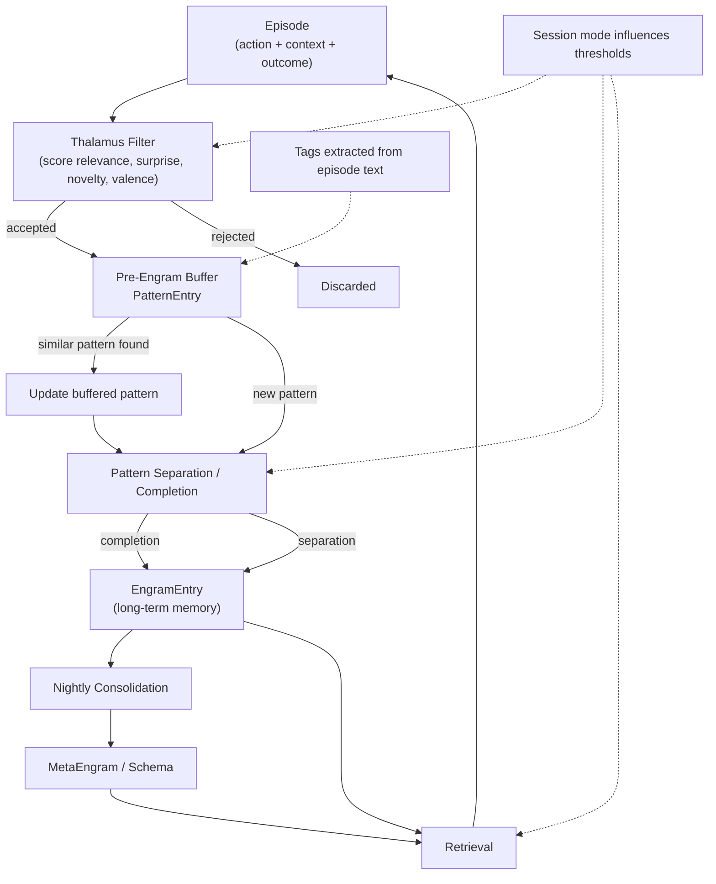
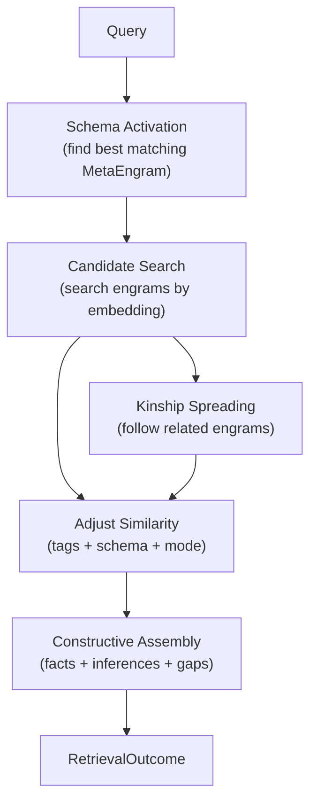

# Episode to Schema Flow

This guide shows how one episode moves through the memory system and how tags are extracted along the way.

## Big Picture

An episode starts as one completed experience. It is filtered, turned into a buffered pattern, promoted into a final engram, and later compressed into a schema.

## Step by Step

### 1. Episode

An `Episode` is the raw memory input. It contains:

- `action`
- `context`
- `outcome`
- `session_id`
- `created_at`

The episode is created in `crates/engram-core/src/models/episode.rs`.

### 2. Thalamus Filter

The runtime scores the episode before it enters memory.

- If the score is too low, the episode is discarded.
- If it is relevant enough, it enters the pre-engram buffer.

This happens in `crates/engram-runtime/src/nodes/thalamus.rs`.

### 3. Tag Extraction

Tags are extracted from the episode's `context` and `outcome` in `token_tags()` inside `crates/engram-runtime/src/nodes/buffer.rs`.

The current logic is simple:

1. Split `context` and `outcome` on whitespace.
2. Convert tokens to lowercase.
3. Keep only tokens longer than 3 characters.
4. Remove duplicates.
5. Keep at most 8 tags.

These tags act as cheap semantic anchors. They help with:

- buffer matching
- engram creation
- retrieval boosting

### 4. Pre-Engram Buffer

The buffer stores a `PatternEntry`, which is the weak, temporary form of the memory.

It keeps:

- a pattern hash
- an embedding
- occurrence count
- strength
- tags
- decay rate
- episode references

This happens in `crates/engram-core/src/models/pattern.rs` and `crates/engram-runtime/src/nodes/buffer.rs`.

### 5. Pattern Separation / Completion

The pattern is compared against stored engrams.

- If it matches an existing engram well enough, that engram is updated.
- If it does not match well enough, a new engram is created.

This happens in `crates/engram-runtime/src/nodes/pattern.rs`.

### 6. Final Engram

The `EngramEntry` is the long-term memory record.

It stores:

- embedding
- tags
- strength
- access history
- source references
- schema links

This is the version of the memory used for later retrieval.

### 7. Nightly Consolidation

Over time, engrams decay or get compressed.

- strong and relevant memories stay active longer
- weak memories are archived
- repeated related engrams become a schema

This happens in `crates/engram-runtime/src/nodes/consolidation.rs`.

### 8. Schema

A schema is a compressed pattern across many engrams.

It helps retrieval by:

- narrowing search
- suggesting expected fields
- exposing gaps in the answer

This is represented by `MetaEngram`.

## Retrieval Sequence

When a query arrives, retrieval does not just look for one memory and stop. It rebuilds a context-aware picture.

### What Happens in Order

1. The query is embedded.
2. The best matching schema is activated.
3. The system searches engrams by similarity.
4. Any engram with a `kinship_ref` can pull in a related older engram.
5. Similarity is adjusted using:
   - tags
   - schema prediction fields
   - session mode
6. The final answer is assembled as:
   - `facts`
   - `inferences`
   - `gaps`

## What Kinship Links Mean

Kinship links are direct pointers between related engrams.

When a new engram is created from a buffered pattern, it may store the nearest prior engram as its `kinship_ref`.

That means:

- this engram has a close memory ancestor
- the system can follow the link later during retrieval
- related memories can be surfaced even if the query only matches one of them directly

In practical terms, kinship links support associative recall:

- query one memory
- find its close relatives
- spread activation into nearby memories
- assemble a fuller answer than a single vector match would provide

## What Tags Do

Tags are not the main memory representation. They are supporting signals.

They help the system:

- recognize similar patterns faster
- boost retrieval when the query uses related language
- cluster related engrams during consolidation

In short:

- embedding = semantic fingerprint
- tags = human-readable anchors
- schema = abstract pattern across memories
- mode = policy for how strict the system should be
- kinship = direct link between related engrams

## Why This Matters

This flow keeps the architecture separated:

- episodes are short-lived facts about what happened
- patterns are temporary candidates for memory
- engrams are stable long-term memories
- schemas are higher-level abstractions

That separation is what lets the system learn without immediately overwriting itself.
